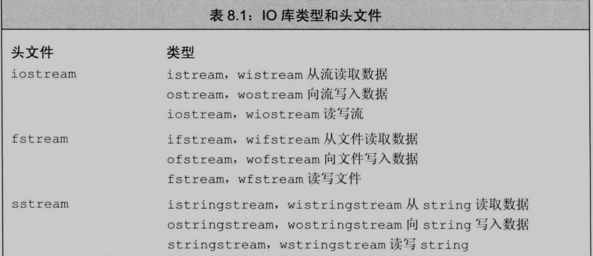
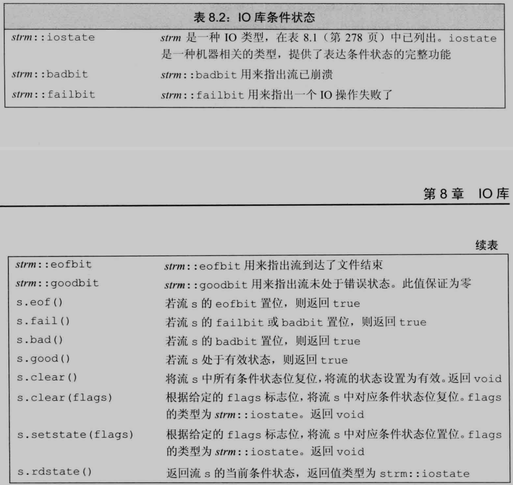
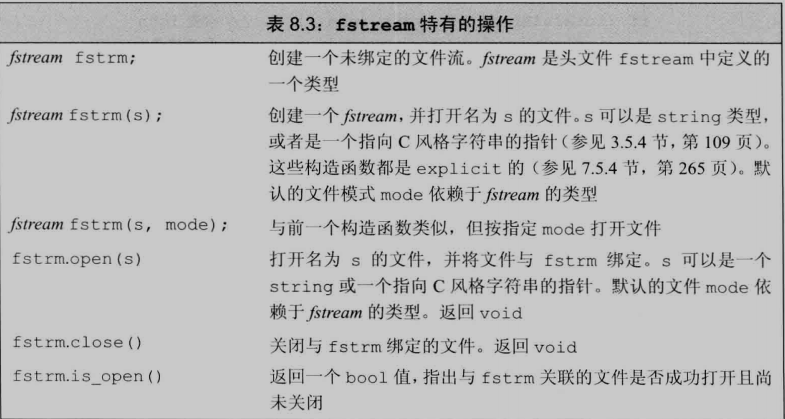
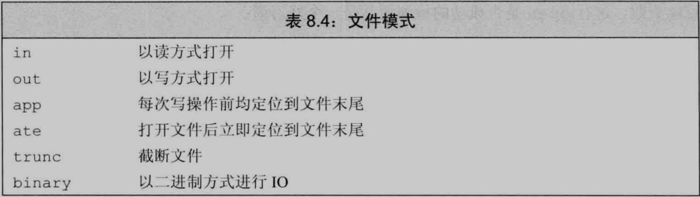
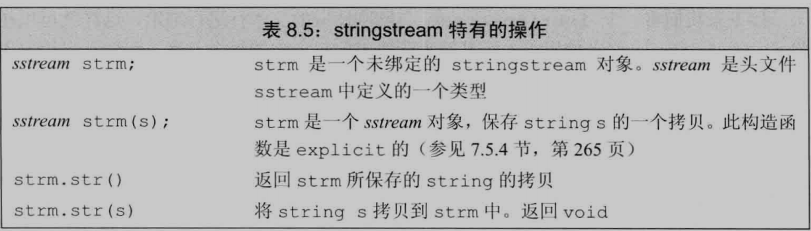
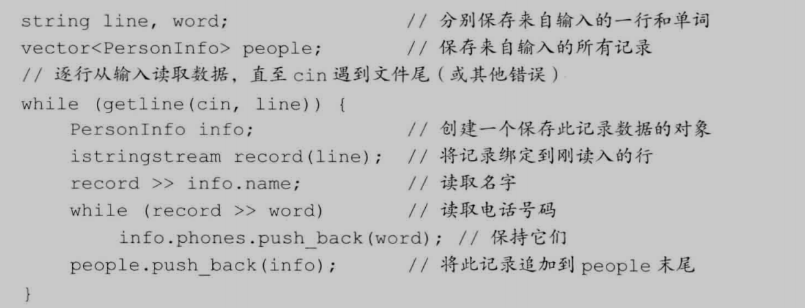
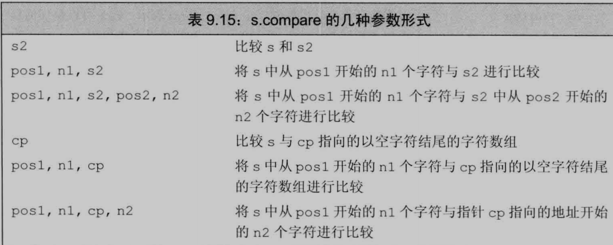
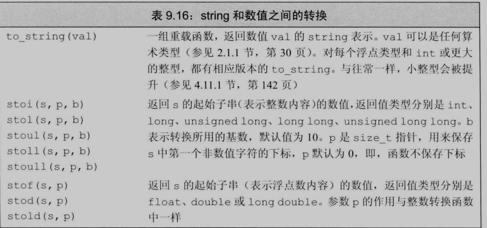

std::endl还有清除缓存区的作用; std::cin>> 返回的是流的状态, 可以while (std::cin>>p) 来循环输入,直到遇到换行符; 
当表达式既有有符号又有无符号的变量时, 一般自动转换为无符号; 可以用前/后缀u8,LL,F,UL(unsigned long)来指定字面类型; using int_array = int[4]; typedef int int_array[4];
**变量初始化**: 变量创建必须初始化, 可以用列表赋值, 如int a = {0}, b{a},c{3.0} 转换的值信息不能丢失, 最后一种错误;
**变量命名规范**: 一般由小写字母和数字构成, 当自定义类型时要大写首字母,如Note, 多个单词构成的变量应区分写如last_poin或lastPoin;
**复合类型**: 1. 引用: 在定义时使用,并且必须初始化, 初始化必须是一个对象 int &a = 8 (错误, 8不是对象), 且不能改变; 2. 指针 void *一般只用于函数的输入输出; 为了弄清楚复合类型, 我们应该从右往左看;
## 基本数据类型
### const 
1. 共享 const修饰的遍历引用和定义都要加extern;
2. 引用 : 如果引用的类型一致那么可以通过其他引用来改变 &b的值, 不能通过b来改变, 如例2; 类型不一致系统会用临时变量保存, 例1;
```
    // 例1
	float i = 43.1;
	float &a = i;
	const int &b = i;
	a = 4;
	cout<<i<<" "<<a<<" "<<b;  // 输出4 4 43,因为实际上为了&b = i正确执行, 系统会执行const int temp = i; b = temp;
    ================================================================
    // 例2
 	int i = 43;
	int &a = i;
	const int &b = i; 
	a = 4;
	cout<<i<<" "<<a<<" "<<b;  // 4 4 4;
```
3. 指针和const
const的位置决定修饰的是什么变量;
```
	int a = 43;
	int a1 = 42;
	int *const b = &a;
	const int *b1 = &a;
	*b = 3; // 正确
	b1 = &a1; // 正确 不能改变的是 *b
	*b1 = 3; // 错误 const修饰的是*b1的值
	const int c = 43;
	const int *const d = &c;
	*d = 3  // 错误
```
常量指针和指向常量的指针可以指向常量和非常量, 但是非常量指针只能指向非常量;
```
	int c = 3;
	const int a = 2;
	int const *b = &a;  // 正确
	b = &c;             // 正确
	int *a1 = &a;    	// 错误
	int &a2 = a;   		// 错误
	int *a3 = b;      //错误
	const int *a3 = &a;  //正确
```
1. 常量表达式
constexpr(c++ 11) 申明的必须是常量表达式; const p = f(), 不算常量表达式, 只有编译时就知道的值才叫; constexpr int *a等价int const *a;
### 处理类型
1. 类型别名 
using u16 = unsigned int; typedef char *charptr;
2. auto 的用法
aoto会保留底层const, 忽略顶层const
```
	const int a = 10;
	int b = 30;
	auto a1 = &a;
	auto &a2 = a, *a3 = &a; //a2是整形常量的引用, a3是指向整形常量的指针;
	a1 = &b;  //正确 
```
3. decltype
顾名思义, 清楚的类型, 用decltype(f()) a 修饰的变量就是f()函数返回值的类型, 或者其他用decltype(i)当i是引用的话a也是引用类型, 当用decltype((i)) 两个括号的话一定是引用类型;
## 字符串向量和数组
### 命名空间
原因:因为库的函数名和类型名都有命名空间, 比iosteam库的命名空间为std, 当访问类cin时需要加 std::cin, 当申明了变量空间后就不需要加std::; 格式: using namespace::name; 应该避免在头文件中申明命名空间;
### string
1. 初始化
string a(n, 'c');
2. 操作
<<, >> 输入输出; getline(is, s) 读取is中的字符串到s中, 字符串已空格结束, 返回is; .size()的类型是无符号的并且肯定可以装下string的大小; 比较符 <=, == 只有长度和字符都相同的才相等, 否词返回的结果是遇到不相等的字符的比较结果; s.c_str() 返回const char *类型, 我们叫做c风格字符串, 当改变s的值可能使得之前的返回值失效, 所以当s.c_str()赋值的话应该重新拷贝一份;
3. 处理字符
遍历可以用下标和迭代器, 迭代器如果引用 for (aoto & p : s) 的话,改变 p 的值也可以改变s中的值; 下标可以随时随机访问
### vector
1. 初始化
vector<T> v1(n, 0); vector<T> v1{1, 2, 3, 4}, vector<T> v2(v1); int arr[] = {1,2,3,4}, vector<int> v1(begin(arr), end(arr)) 与 vector<int> v1(arr, arr + sizeof(arr)/sizeof(arr[0])) 相同; 当创建的vector时没有赋值时, 会自动按照元素类型进行初始化赋值; 
2. 添加元素
push_back 和 初始化时定义长度;
3. 其他操作
== 可以判断两个vector是否大小和元素都相等;
### 迭代器
++, --, +1, -1; *item是引用类型; v1.begin()的类型是vector<int>::const_iterator 而v1.end()的类型是vector<int>::iterator; 当使用了迭代器的循环体, 都尽量不要向迭代器所属的容器添加元素; 迭代器和整数的相加和相减会得到向前/后移动若干位置的迭代器;
## 表达式
### 左值右值
对象的左值和右值, 当一个对象用作左值的时候是用的在内存中的位置, 用作右值时是用的在内存中的值;
除了数组、函数、不完整类型的所有左值都可以转换为右值;   右值要加*解符号转换为左值; 左值加&地址符可以转换为右值; 引用又叫左值引用; c++11定义了右值引用;
如果表达式的求值结果是左值则decltype返回的是引用类型, 比如int *p, decltype( *p)的类型是int&, decltype(&p)的类型是int **;
### 运算符
当位数较小的数和较大的数运算时会转换为位数大的; % 必须两边是整数, 结果的正负和余数相同; 
逻辑运算符具有先后性; 赋值运算左测必须是可修改的左值, 且右侧的类型会转换为左侧, 满足结合律; 
a += 1 需要一次求值 a = a + 1 则需要两次求值; *ite++; 
位运算符一般只对无符号类型操作;
sizeof p , sizeof(p) 优先级和 *一致, 只有对数组(vector string int[]等) sizeof才是数组占的字节数, 对指针是指针的大小;
, 返回的是右侧执行的表达式的值;
### 类型转换
#### 算术转换
当运算时运算的类型不一致则会转换为同一个类型; 整型直接的运算会提升, 整型遇浮点型会转换为浮点型, 有布尔类型则会转换为布尔类型;
#### 隐式转换
数组转换为指针 int *p = arr; 指针的转换, 指向任意非常量的指针能转换成void *, 指向任意对象的指针能转换成const void *; 转换成常量 int i, const int &i1 = i, const int *i2 = &i; 
#### 显示转换
1. static_cast, 只有不包含底层const, 都可以用此强制转换double *p1 = static_cast<double *>(p) p为double *型;
2. const_cast, 能去掉底层const的性质;
3. reinterpret_cast 提供低层次上的重新解释, 与c语言的强制转换类似, 一般不使用;
## try和异常处理
1. throw runtime_error("data too big") 必须使用字符串初始化异常类;
2. 一个try和多个catch, 当是改类型错误时, 使用err.what()显示错误信息; catch(runtime_error err) cout<<err.what(); 
## 函数
局部静态变量 static, 当第一次经过时初始化, 直到程序终止才被销毁;
### 参数传递
c++一般用引用传参, 因为拷贝传参太低效; 当无需改变实参时, 应该用const int& 来定义形参;
引用形参'返回'多个参数;
形参传递数组的3种等价形式, void f(const int* p), void f(const int[] p), void f(const int[10] p);
使用使用litializer_list作为可变形参, 前题是类型相同且是常量; litializer_list<int> l1 {1, 2, 3, 4} 都是常量; egg({,2, 3});
省略符形参..., 一般只用与c/c++通用的类型
```
/*
1、处理不定参数的函数要包含头文件：#include <stdarg.h>
然后在处理不定参数的函数中先定义一个参数列表变量：va_list ap。
2、确定不定参数所在的位置。在这里，第一个参数为str，因此要从第二个参数进行获取参数列表。va_start(ap, str);表示在str参数之后获取参数。由于C调用是从右到左依次将参数压入堆栈的，因此处理起来比较容易。
3、获取参数并指明类型，如：va_arg(ap, char*);获取第一个参数，并指明类型为char* 。
在main()函数中就对应着实参"world"；va_arg(ap, int);紧接着再取一个参数，并指明类型为int，对应main()函数中的实参1；va_arg(ap, double);再接着取第三个参数，并指明类型为double，对应main()中的实参3.14。
4、最后注意要有va_end()
*/
	#include <stdio.h>
	#include <stdarg.h>
	void Function(const char *str, … )
	{
		va_list ap;
		int n = 3;
		char *a = NULL;
		int b = 0;
		double c = 0.0;
		va_start(ap, str); // 注意！这里第二个参数是本函数的第一个形参
		a = va_arg(ap, char*);
		b = va_arg(ap, int);
		c = va_arg(ap, double);
		// 浮点最好用double类型，而不要用float类型；否则数据会有问题
		va_end(ap);
		printf("%s is %s %d, %f", str, a, b, c);
	}
	int main()
	{
		Function(“Hello”, “world”, 1, 3.14);
		return 0;
	}
```
### 返回类型
1. 返回类型: 返回引用时, 不会拷贝, 返回的是一个别名, 因此不能返回改函数的局部变量的引用; 返回的都是拷贝的内容, 别名; 函数调用的优先级;
2. 作为左值: 当返回值是指针或者引用时才能作为左值; { }返回的使用;
3. 其他申明方式: auto f(a )-> int(*)[10] 的尾置申明; 如果知道函数要赋值给哪个变量的话可以用 *decltype()申明;
### 函数重载和其他函数
1. 函数重载: 不能不同返回类型, 但是参数完全一样;  const常量形参可以传入非常量和常量;
2. 默认实参: 可以多次声明, 但是一个形参只能赋予一次默认值, 后面声明的只能添加, 调用时只能省略后面的参数, 不能省略前面的, 如f(1) 正确, f(,1,1) 错误, 所有设计函数的时候要注意参数的顺序;
3. 内联函数: 为了减小调用函数的开销, 比如入栈等, 一般用于轻量级函数, 声明和顶以前加inline; 内联说明只是向编译器放出一个请求, 编译器也可以忽略这个请求; 很多编译器都不支持内联函数递归; 可以多次定义(比如一个.cpp文件定义一个共同的, 但是都包含声明的.h文件);
4. constexpr函数:  只能有一个return, 当return返回的表达式是常量的话返回常量, 否则返回非常量, 编译时, 编译器会将改函数优化为内联函数并将调用替换为结果值; 可以多次定义(比如一个.cpp文件定义一个共同的, 但是都包含声明的.h文件);
```
	int i = 1
	int a[f(1)]; // 正确
	int b[f(i)]; // 错误
	constexpr int f(int a) {
		return a * 2;
	}
```
### 函数指针
1. 将函数名作为一个值使用时, 改函数自动的转换为指针; bool (*p)(int,double), 必须指定形参和返回;
2. using F = int (int *, int), using FF = int( *) (int *, int) F是函数类型, FF是指针类型;
3. decltype()作用于一个函数时返回的是函数类型;

## 调试帮助
### assert
预处理宏, 所有不能用using,等重命名; assert(expr6) 为假则输出信息并终止程序 为真则什么都不做 
例:assert(v1.size() > i) 用于检测是否i是否大于v1的大小;
### NDEBUG
预处理变量; 当定定义了NDEBUG时,则assert无效, 相当于退出调试模式; NDEBUG必须定义在<assert.h>前, linux可以 gcc -D NDEBUG main.c来定义预处理变量; 一个函数调用时会定义它的名字保存在__func__中,  c++中还有 __FILE__存放文件名的字符串字面值, __TIME__编译的时间以字符串值, __LINE__当前行号的整型字面值, __DATE__编译的日期以字符串值

## 类
class和struct的区别;类内可以用typedef/using定义别名, 先定义后使用; 提供类内初始值时用=或花括号表示;
class '类名' 进行声明, 一般用于指针指向这个类, 但类并为定义; 成员函数中this->和类名::都可以访问数据成员;
编译器处理完类中的全部声明后才会去处理定义; 类中如果有成员使用了定义的别名, 则该别名不能在类中重新定义该名字;
### 成员函数
定义在类内部的成员函数是隐式的内联函数; 常量对象以及常量对象的引用或指针都只能调用常量成员函数;
用total.isbn() 实际上隐式传入了total的地址, 而且类型是常量指针(this); 可以在声明isbn()时的形参列表后面加上const来修饰隐式this指针为指向常量的常量指针;
### 构造函数
默认初始化 Teacher() = default 当给内置成员提供了初始值才能使用; 构造函数初始值列表的运用; 
委托构造函数, Sale_data(string &s) : Sale_data(s, 0, 0) {...};
构造函数可以有默认实参来初始化, 当一个构造函数为所有参数提供了默认实参, 实际上也有了默认构造函数;
可以通过类的构造函数隐式的进行转换, 比如ite.combine(3), 隐式转换为ite.combine(Sale_data(3)), explicit声明构造函数可以阻止这种隐式转换, 但是ite.combine(Sale_data(3)), ite.combine(static_cast<Sale_data>(3))显式转换可以; 
标准库中接收一个容量参数的vector构造函数是 explicit 的;
### 初始化和this指针
返回类的引用和返回类的区别, 在都是返回 *this时; 返回const类引用和一般类引用的区别, 在都是返回 *this时;
可以根据传进的this指针是指向常量的常量指针(参数列表后加了const)还是普通常量指针来进行重载函数;
成员函数查找名字声明的过程, 1. 函数定义中查找. 2. 类中成员中查找. 3. 该函数定义之前的作用域内查找;
当数据成员中有const, 引用类型时, 我们总是用构造函数的初始化列表来初始化; 初始化列表的初始化顺序不会影响实际的初始化顺序(定义的顺序);
### constexpr类和函数
constexpr类, 有constexpr构造函数, 数据成员都是字面值类型, 数据成员如果有初始化值, 则初始化值必须是一条常量表达式,  如果成员是类类型, 则初始值必须使用成员自己的constexpr构造函数, 类必须使用析构函数的默认定义;
constexpr构造函数, 一般都是空的, 用于生成constexpr对象以及constexpr函数的参数和返回值,可以写成 = default, 一般用列表初始化值, 必须初始化所有成员, 初始值;
### static数据成员和函数
static函数不能使用this指针, 但是可以直接访问static数据成员, **static数据成员一般在类内声明**, 类外定义(前面需要加上类名), 定义时不加static, 在类的外部定义和初始化每一个static数据成员, **定义时可以访问类的私有成员**, 一旦被定义就存在于程序的整个生命周期中, 常量可以在类内定义, 可以使用静态成员作为默认实参; 因为在类中是声明, 所以可以是一些不完全的类型, 比如static Bar man;

## IO库
fstreamh和sstream是iostream的继承类型;
### 创建和条件状态
类的头文件和名字: , 流对象不能拷贝或者赋值, 所以IO类的参数和返回值只能是引用或者指针;
IO库条件状态: ;
### 缓存刷新
输出缓存区的刷新情况, 1.程序结束或者栈满. 2. endl, flush, ends或者unitbuf, cout<< unitbuf每次输出都刷新, cout<< nounitbuf恢复正常. 3. 关联的输入和输出流, tie的用法, 例如cin.tie() 返回cin关联的输出流的指针, cin.tie(&cout) cin和cout关联并返回cout的指针. 程序崩溃之后不会刷新;
### fstream类

ifstream in(file)  ofstream out(file) 构造并打开给定文件, 也可以创建的时候不关联, 用open和close来建立和取消关联, 判断文件是否打开成功, 直接if (in或者out)就行, 当对象被销毁时, close会自动调用;
, ifstream默认in模式, ofstream默认out模式, fstream默认in | out模式, 只有当out设定时才能trunc, app会自动out, out会自动trunc, ofstream out(file, ofstream::app | ofstream::out);
### sstream类
, stringstream, istringstream, ostringstream和fstream, ifstream, ofstream类似;
;
```
	string s = "leetcode exercises sound delightful";
	stringstream ss1(s);
	string a;
	while (ss1>>a) {
		cout<<a;
	}
```
## 顺序容器
list, vector, foward_list, deque, arry; 可以考虑在输入的时候用list来随时插入, 输入完再拷贝到vector里面; 当不确定用list还是vector时, 可以只使用公共操作, 使用迭代器, 必要时再使用list或vector;
### 构造
当使用vector<P> v1(3, P(3))构造时, 由于是复制的P, 所以P的构造函数只执行了一次, 后面两个是赋值, vector<P*> v1(3, new P(3))构造时, 3个指针指向同一个地址;
构造string的其他方法: s(s2, len); s(s2, pos); s(s2, pos, len);
默认情况下, stack和queue是基于deque实现的, priority_queue是vector实现的, 我们可以在创建适配器时给定第二个参数来表示用哪种顺序容器只要对应容器有相应操作;
### 遍历
v1.cbegin()返回的是const_iterator, 不能修改元素值, v1.rbegin() 指向尾元素的迭代器, v1.crbegin(), 也是++的形式遍历而不是--;
迭代器进行拷贝时不需要容器类型一致, 拷贝需要; 只有顺序构造器的构造函数才接受大小参数, 并联容器不支持;
v1.back(), v1.front(), v1.at(i), v1[i], 返回的都是引用;
对于vector和string, 我们可以用v1.capacity()来知道现在可以容纳多少元素, v1.reserve(n)v1至少能容纳n个元素, 只有当v1.capacity()小于n时, v1才会扩张; v1.shrink_to_fit()来把容量降低为size()的容量;
### 增,改
insert在vector和deque上面很耗时, 返回插入元素后指向插入元素的迭代器; emplace,emplace_back,emplace_front,都是在容器中直接构造元素, 传递的参数必须与元素类型的构造函数相匹配,例v1.emplace_back(3, "hi") == v1.emplace_back(P(3, "hi"));
当插入时, 只有vector, string和deque(如果不是在首尾插入, 当插入首时, 只有之前的begin()会失效, 当插入尾时, 只有之前的end()会失效)之前的迭代器和引用等会失效;
substr(pos, len), 字符串的插入和删除还有下标版本insert(pos, len, "s"), s.apend("s"), s.replace(pos, len, s1);
assign用来对允许不同但相容的类型进行拷贝(仅顺序容器), v1.assign(v2.begin(), v2.end()), v1.assign(v2), v1.assign(n, t);v1.resize(n, t)只改变元素的数目;
swap(a,b)不对任何元素进行拷贝, 只是交换了两个容器内部的数据结构, 所以swap后原来的指针引用迭代器都有效(除了string类型);
### 删
v1.erase(p), v1.erase(v1.begin() + 1, v1.begin() + 5), v1.clear(), 返回删除数组的指向下一个元素的迭代器;
p = v1.begin(), v1.erase(p), p == v1.begin() 删除是依次向前移动一个位置;
foward_list的插入和删除必须要找到前一个迭代器才行, erase_after(p)和insert_after(p, t)都是在p后面添加或者删除;
当删除时, vector, string删除的迭代器之前的有效, list除了删除的总是有效;
### 字符串操作
字符串的查找: s.find(args), s.rfind(args)最后出现的下标, s.find_first_of(args)args任意字符第一次出现的位置, s.find_last_of(args)args任意字符最后一次出现的位置, s.find_first_not_of(args)第一个不在args的字符, s.find_last_of(args); args可以是(c, pos), (s, pos), (cp, pos, n);返回的是unsigned类型;
 可以指定开始位置比较, 返回0, 1, -1 分别代表相等, 大于, 小于;
;
## 泛型算法
实现了经典算法的公共接口; 泛型算法不会执行容器的操作, 只会运行与迭代器之上, 执行迭代器的操作; 算法永远不会直接添加和删除元素;
begin(v1) == v1.begin(); end(v1) == v1.end();
fill(v1.begin(), v1.end(), n); fill_n(v1.begin(), v1.size(), n);
back_inserter(v1) 接收迭代器的引用, 返回与该迭代器绑定的插入迭代器, 每次赋值都会调用push_back();
```
	vector<int> v1;
	auto p = back_inserter(v1); 
	*p = 5; // 等于v1.push_back(5);
	*p = 6; // 等于v1.push_back(6);
	fill_n(p, 10, 0); // 后面添加10个0;
```
auto p = copy(v1.begin(), v1.begin() + 2, v2.begin()) 返回目的位置迭代器递增后的值 p == v2.begin() + 2;
replace(v1.begin(), v1.end(), 0, 42) 将v1中的0都替换为42;
replace_copy(v1.begin(), v1.end(), v2.begin(), 0, 42)保存在v2中(v1不变), 可以用back_inserter(v2)当v2为空时;
auto p = unique(v1.begin(), v1.end), 将重复元素移动到末尾, 返回指向不重复值末尾的迭代器, 可以调用v1.erase(p, v1.end())删除;
stable_sort();
### lambda表达式
['捕获列表']('参数列表') ->  'return type' {'函数体'}, 使用尾置的返回类型, 参数列表和返回类型可以忽略, 当忽略返回类型, 只有return根据返回值来判断返回类型,否则返回void, 相当与一个内联函数; 可以声明定义auto p = [] {return 666;}, cout<< p();没有默认形参; 因为lambda表达式不能访问外面的变量, 所以需要手动在捕获列表添加要用到的局部变量; 引用捕获来捕获迭代器或指针; 可以[=], [&]来隐式的设置捕获列表, 可以[=, 'list'], [&, 'list']; 拷贝赋值不能改变拷贝后的捕获参数, 且是在定义时拷贝的; auto g = bind(f, a, b, _2, _1, c) _1, _2是占位符, 原名是std::placeholders::_1, 调用g(1,2) == f(a, b, 2, 1, c), 当我们需要传递给bind一个对象时而不是拷贝它, 我们需要用ref(os), 来返回一个包含os的对象和引用, 并且该对象可以拷贝;
### 再探迭代器
#### 插入迭代器
back_inserter(v1), front_inserter(v1), inserter(v1, v1.bein() + 1) 再v1.bein() + 1之前插入;
#### iostream迭代器
istream_iterator<int> in(cin), end 当读取到错误的值时候, 或者末尾就会返回end; *in 表示从流中读取的值, in++ ++in表示使用>>读取下一个值, 返回的是后置或者前置 cin可以是任何具有>>运算符的类型;   
ostream_iterator<int> out(cout), out1(cout, s) out1表示每输出一次再后面加一个s字符串; out = val, 输出1; *out 返回out;
可以将读取到的类型设置为一个类, 但是必须有构造函数是单个参数并且输入正确, 就可以隐式转换为类并返回;
迭代器类别:
输入迭代器: 用于顺序访问和读取; 输出迭代器: 只写不读, 单次扫描; 向前迭代器: 向一个方向移动, 可以多次扫描和读写; 双向迭代器: 双向移动, 可以多次扫描和读写 如list的迭代器和关联容器的迭代器; 随机访问迭代器: 在双向迭代器的基础上可以常数时间内访问所有元素, 如sort;
特定容器算法:
_if结尾的算法, 传递一个比较的谓词, 如find_if(v1.begin(), v1.end(), compare), 返回第一个使compare非0的元素;
_copy结尾的算法, 写到额外目的空间, 如reverse_cooy(v1.begin(), v1.end(), v2.begin()), 逆序拷贝到v2;
当使用list和forward_list时, 需要用其成员函数, 如果list.sort(), 因为list和forward_list分别提供双向迭代器和迭代器;
## 关联容器
map, unordered_map, set, unordered_set, multimap, multiset; 双向迭代器;
### 概念
顺序关联容器可以自己定义 < 运算符, 但是必须遵守一些规则;
pair默认构造函数对数据成员进行值初始化; 数据成员有key_type, value_type, mapped_type (每个关键字关联的类型); 
我们可以改变map中ma1->second的值, 但不能改变ma1->first的值; set中的关键字也是const类型;
一般不对并联容器使用泛型算法, 实际编程中使用的话一般作为源序列或者目的位置
### 增查删改
insert/emplace对应迭代器版本和初始化列表版本, 以及向迭代器p表示中从哪里开始搜索新元素应该存储的位置, 返回一个pair类型, first是插入元素的迭代器, second是表示是否插入的布尔类型, 0表示已经存在, mutimap的返回一个新元素的迭代器;
erase的3个重载函数, 第一个删除关键字为k的元素, 返回删除的个数; 第二个给定迭代器删除, 返回该迭代器后面的迭代器; 迭代器范围删除;
只有map支持下标, map[i]是一个左值, 为mapped_type类型, 但是解引用迭代器返回的是value_type类型;
### 类置函数
c.lower_bound(), c.upper_bound(), c.find(), c.count(), c.equel_renge(k) 返回关键字k的范围的迭代器pair; 
可以count(), find() 或者c.lower_bound(), c.upper_bound()配合使用来遍历multimap的某个关键字;
### 无序容器
底层是通过hash函数来映射到不同的桶中的, 相同的关键字一定在一个桶中, 我们可以调用函数来得到当前桶的数量和具体的桶的大小, 为了使得我们自己的结构体可以使用该容器, 我们需要实现 == 运算符和 hash函数的返回值, 定义时unordered_map< Node, decltype(hasher)*, decltype(eqOP) *> ma1(1e4, hasher, eqOP);
```
size_t hasher(const Node &node) {
	return hash<string>() (node.name);
}
bool eqOP(const Node &node1, const Node &node1) {
	return node1.name == node1.name;
}
```
## 动态内存
initializer_list<T> ls1, 可以传入{}表示的参数;
### 智能指针
shared_ptr: 为一个模板, shared_ptr<T> p1, p1是一个能指向T类型的指针, 默认为空; 我们可以直接p1 = p2, p1(p2), make_shared<T>(args) arg会调用T的构造函数(底层是new同时分配了对象空间和计数空间), p1(new T(), 'deleter') (deleter为自定义删除器, 可以不用,先分配T的空间再分配计数空间, 没有make_shared快), 当p1指向对象时, 则返回1, p1.get()返回p1中保存的内置指针(一般只要保证不会被delete才使用), p1.unique() 唯一则返回1, p1.use_count() 返回指向p1指向对象的智能指针数目 p1.reset(new T()) 重新指向; 当智能指针销毁或者被赋值时, 指向改对象的智能指针数量就会减1, 当赋值和初始化时会加1, 当为0时会释放该对象和相关联的内存; 
unique_ptr: 和shared_ptr不同的是, 某一时刻只能有一个unique_ptr指向给定对象; unique_ptr只能直接初始化, p1(new T()), p1(p2.relese()), p1.set() 释放对象, p2.relese() 不能单独使用 释放对象并返回指向对象的指针,  p1.set(p2.relese()), unique_ptr只能拷贝或赋值一个即将删除的智能指针; 该智能指针也可以传递删除器, 但因为特性而有点特殊;
### 其他指针
weak_ptr: 绑定到一个shared_ptr上面, 增加和删除不会影响引用计数的数量, 可以进行直接赋值和初始化, p1.reset() 将p1置为空, p1.use_count() 返回shared_ptr的数量, p1.expired() 共享指针数量为0返回1, p1.lock() p1.expired()为1返回空, 否则返回指向p1的对象的shared_ptr;动态数组: 用new string[100]({"",""})和 delete [] , 或者unique_ptr管理; allcator: 可以分配为构造的内存, 预留空间来动态分配;
## 拷贝控制
花括号列表初始化一个数组中的元素或者一个聚合类中的成员会调整拷贝初始化; push_back, insert都是拷贝初始化, 而emplace是直接初始化;
### 拷贝构造函数和赋值运算符
拷贝构造函数被用来初始化非引用类类型的参数, 所以拷贝构造函数自己的参数必须是引用类型;调用的是拷贝构造函数还是赋值运算符，主要是看是否有新的对象实例产生。如果产生了新的对象实例，那调用的就是拷贝构造函数；如果没有，那就是对已有的对象赋值，调用的是赋值运算符;
析构函数: 释放非static数据成员, 不需要控制成员如何销毁, 析构部分是隐式的, 销毁类类型的成员需要成员自己的析构, 智能指针会自己销毁, 当对象被销毁时调用; 析构函数并不直接销毁成员, 成员是在析构函数之后的析构阶段销毁的, 销毁顺序是初始化的逆序, 对于有些类, 合成析构函数可以阻止该类的销毁;
当我们自定义了析构函数时, 通常情况下都要自定义拷贝构造函数和赋值运算符重载, 因为重写析构函数通常伴随着delete, 当我们delete一个指针成员时, 当有第二个对象执行析构函数时就会delete一个已经delete的指针, 造成错误, 当作为返回值时, 会先delete再执行拷贝构造函数, 更容易出错; 但是当自定义拷贝构造函数和赋值运算符重载时, 一般不需要自定义析构函数;
### 资源管理
=delete可以显示的定义合成的内置函数; 也可以=delete将内置函数删除, 或者将内置的函数定义为private也默认为删除状态, 当删除了析构, 就只能动态创建; 我们可以管理不同资源的类: 自定义拷贝构造函数和赋值运算符重载使得一个类来控制一个new的对象; 
类值的类: 我们需要自定义拷贝构造函数和赋值运算符重载以及析构函数, 其中每个类的数据成员都有自己独一无二的分配好的内存, 当调用析构函数时, 必须手动释放已经分配内存的指针, 调用拷贝构造函数需要让指针指向新的new出来的对象, 调用赋值运算符时, 应该先删除拷贝的类的动态分配的内存, 再将被拷贝的复制, 重新分配内存;
类指针的类: 利用计数器来控制共用动态资源的销毁, 加入一个指针来指向计数器的个数, 初始化为1, 当执行拷贝构造时, 计数器的值+1, 当执行赋值时, 被赋值的计数器-1, 赋值的计数器+1, 当计数器为0时就手动释放动态内存;
### 移动和右值引用
标准容器库, string, share_ptr类既支持移动也支持拷贝, IO类和unique_ptr类只支持移动;
&&为右值引用符, int &&arr1 = 42, 右值引用的赋值对象只能是右值, 以及即将销毁的对象, 我们可以通过std::move(i)来将i变成右值, 因为即将销毁, 实际上右值引用是接管了该片内存, 将生命周期延长了;
移动构造函数和移动赋值运算符应该具备的是检测自赋值和移动后源对象可析构的状态; 当没有定义时自动调用拷贝构造函数, 有些情况无法自动合成会被定义为删除函数; 当移动/拷贝构造函数时, 根据函数匹配和赋值操作类型决定使用哪一种, v1.push_back("666") 移动， v1.push_back(s) 拷贝;
引用限定成员函数：用 & 和 && 来修饰函数, 表示调用函数的类的类型， 声明和定义中都要加上, 并且相同参数的重载函数必须要加引用限定符, bool f() const &;
### 类中的运算符重载
'返回类型' operator 重载符(const &Num)来重载一些符号, 有些前后都加const 如bool operator<(const &Num) const {return val < Num.val}, Num operator=(const &Num), 不能重载类似, sizeof, .这种符号, 赋值运算符只有在不是定义的情况下才触发, 如 Num a = b, 这个会调用Num的拷贝构造函数;
std::swap函数自动会进行一次拷贝, 两次赋值, 当我们对类自定义swap时, 应该声明为friend, 并且为定义为内联函数, 我们调用时应该调用swap而不是std::swap
, 定义void swap() {using std::swap } ;
int a, b, a += b 等价于 a.operator+=(b); 输入输出运算符重载用友元, 这样我们就能不用创建对象而直接调用函数; 输入必须检测是否成功; 可以定义为成员函数和非成员函数两种; 赋值运算符和复合赋值运算符, 下标,必须定义为成员函数, 返回左侧引用; 区分前置运算符++和后置++的条件是前置没有形参, 后置的形参为int, 编译器会置为0, 也可以通过传入参数的个数来显示调用;
```
	Node operator+(const Node&, const Node&); // 声明为非成员函数;

	friend ostream &operator<<(ostream &os, const Node& a) {
		os<<a.a<<" "<<a.b;
		return os;
	}
	istream &operator>>(istream &is, const Node& a) {
		int a1, b1;
		is>>a1>>b1;
		if (is)   // 输入成功
			a.a = a1, a.b = a2;
		else
			a = Node();
	}
```
### 函数对象
:可以直接进行类似函数的调用, int buf = Node(3); 标准库定义了算术,逻辑和关系的运算类, 如greater<T>, less<T>;
```
  int operator() (int a) const {
	return a ? a : -a;
  }
```
function<int(int,int)> f1 = add, add是一个非成员函数, f1的模板表示只接收一个返回为int,两个参数都是int型的函数指针, 当为成员函数时, 应该为Add(), 也可以执指向一个lamda函数, 可以通过定义```map<string, function<int(int,int)>>```来显示的选择调用函数, 因为只提供了函数的指针, 所以容易引起歧义, 参数不一样时如何调用, 我们可以定义一个函数指针先指向我们想添加进的函数,再指向function;
### 类类型转换符
定义类类型转换符```operator int() const {return val}```;  不允许转换成数组或者函数类型, 不能声明返回类型, 列表也为空, 一般定义向bool的转换很普遍; explicit 可以避免隐式的转换, 复习下如果有explicit的话需要用static_case<T>(v1)来显示转换;
避免二义性: 1.不要让两个类执行相同的类型转换, 如A类有以B类为参数的构造函数, 就不要让B类有转换为A类的运算符, 定义了算术运算符就不要定义算术类型转换符, 不要定义转换到多种类型的类型转换, 一句话, 除了显示的转换为bool外, 其他的少用;

