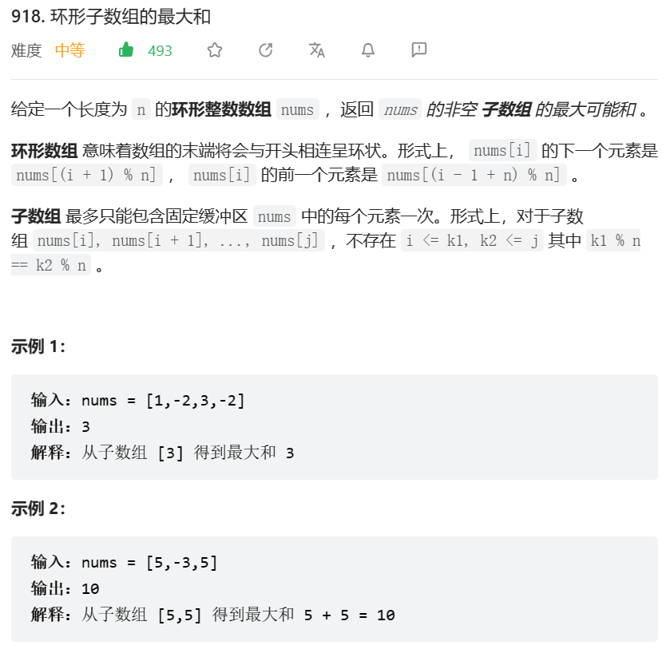

## bfs队列和stack,dfs
### 2577. 在网格图中访问一个格子的最少时间
;
Dijkstra最短路算法, 需要注意的是反复横跳来得到当前最短时间;
### 1210. 穿过迷宫的最少移动次数
**题意**: 在一个n*n迷宫里面, 有一条单位长度为2的蛇, 蛇有竖直状态和水平状态, 竖直状态下, 蛇可以向下移动一个单位或者整体向右移动一个单位, 或者以尾部为轴, 逆时针旋转为水平状态; 水平状态也可以向下和向右平移, 顺时针旋转为竖直状态; grid表示迷宫的障碍物, 1有,0无, 如果旋转和平移遇到障碍物则无法移动, 求水平状态在0,0再以水平状态到达n-1,n-1最少的步数;
**分析**: 因为只能往右或者往下, 或者旋转, 我们以蛇尾表示蛇的坐标,再用state表示当前水平还是竖直, 就可以节省很多代码量; 我们如果保证每次状态坐标只遍历一次, 而且为最小值的话, 就只需要遍历一次, bfs可以完美解决;
```
    struct id{
        bool s;
        int y,x,d;
    };
    int minimumMoves(vector<vector<int>>& grid) {
        queue<id> que1;
        int n = grid.size();
        vector<vector<vector<bool>>> vis(2, vector<vector<bool>>(n, vector<bool>(n, 0)));
        que1.push({0, 0, 0, 0});
        while (!que1.empty()) {
            id p = que1.front();
            que1.pop();
            if (p.s == 0 && p.y == n - 1 && p.x == n - 2)
                return p.d;
            if (p.s) {
                if (p.y + 2 < n && !vis[1][p.y + 1][p.x] && !grid[p.y + 2][p.x]) {
                    vis[1][p.y + 1][p.x] = 1;
                    que1.push({p.s, p.y + 1, p.x, p.d + 1});
                }
                if (p.x + 1 < n && !vis[1][p.y][p.x + 1] && !grid[p.y][p.x + 1] && !grid[p.y + 1][p.x + 1]) {
                    vis[1][p.y][p.x + 1] = 1;
                    que1.push({p.s, p.y, p.x + 1, p.d + 1});
                }
                if (p.x + 1 < n && !vis[0][p.y][p.x] && !grid[p.y][p.x + 1] && !grid[p.y + 1][p.x + 1]) {
                    vis[0][p.y][p.x] = 1;
                    que1.push({0, p.y, p.x, p.d + 1});
                }
            } else {
                if (p.y + 1 < n && !vis[0][p.y + 1][p.x] && !grid[p.y + 1][p.x] && !grid[p.y + 1][p.x + 1]) {
                    vis[0][p.y + 1][p.x] = 1;
                    que1.push({p.s, p.y + 1, p.x, p.d + 1});
                }
                if (p.x + 2 < n && !vis[0][p.y][p.x + 1] && !grid[p.y][p.x + 2]) {
                    vis[0][p.y][p.x + 1] = 1;
                    que1.push({p.s, p.y, p.x + 1, p.d + 1});
                }
                if (p.y + 1 < n && !vis[1][p.y][p.x] && !grid[p.y + 1][p.x] && !grid[p.y + 1][p.x + 1]) {
                    vis[1][p.y][p.x] = 1;
                    que1.push({1, p.y, p.x, p.d + 1});
                }         
            }
        }
        return -1;
    }
```
**总结**: 广度优先搜索方法的正确性在于：我们一定不会到达同一个位置两次及以上，因为这样必定不是最少的移动次数。
### 394. 字符串解码
**题意**:输入：例如 s = "3[a]2[bc]"输出："aaabcbc", 输入：s = "3[a2[c]]" 输出："accaccacc";
**分析**: 分析题目发现我们遍历的话, 遍历到的']'总与上次一个'['它们中间的字母有关, 而再遍历到一个']', 又与上上个'['有关, 所以这是一个先进后出的结构, 我们考虑用stack求解, 或者用递归dfs也可以, 需要注意的是当遍历到']'的时候就需要回溯到上一个'['来将中间的字母加倍, 同时需要知道该']'的下标, 才能继续遍历加上']'之后的字母值;
```
    string dfs(int i, string &s) {
        if (i == n)
            return "";
        if (s[i] >= '1' && s[i] <= '9') {
            int j = i + 1;
            while (s[j] != '[')
                ++j;
            int cnt = stoi(s.substr(i, (j - i)));
            string buf = "";
            string p = dfs(j + 1, s);
            for (int k = 0; k < cnt; ++k) {
                buf += p;
            }
            return buf + dfs(index, s);
        } else if (s[i] == ']') {
            index = i + 1;
            return "";
        } else {
            return s[i] + dfs(i + 1, s);
        }
    }
``` 
**总结**: dfs可以用dfs(i+1, s)的形式递归, 也可以在一个大的while(i < n) ++i 的形式递归, 同时while里面也可以更新i的值;
## 二分
### 2576. 求出最多标记下标
;
简单二分;
### 2513. 最小化两个数组中的最大值
**题意**: 给定d1, d2, n1, n2, 并且满足arr1的数目为n1都是互不相同的正整数且都不能被d1整除, arr2同理, arr1的数和arr2互不相同, 找出满足条件下的两个数组的最大元素的最小值;
**分析**: 当求解一个最值的时候我们应该考虑能不能快速将这个值带入能不能满足题意, 并且该值的右侧都满足要求的话左侧都不满足, 或者相反, 这样就可以考虑2分法, 显然我们可以快速判断, 先找出可以同时整除d1, d2的个数b3, 再找出可以整除d1, d2的个数b1, b2, 当我们的b1, b2都减去b3后, 我们的b1, b2就可以用来装n2, n1了, 所以用t表示可以装n1,n2的个数的话, 最开始t就要减去b3, 然后减去(b1 - n2) + (b2 - n1) 如果这两都是负数的话就不用减了, 最后比较t和n1,n2的大小就可以了;
```
    int minimizeSet(int divisor1, int divisor2, int uniqueCnt1, int uniqueCnt2) {
        int l = uniqueCnt1 + uniqueCnt2, r = (uniqueCnt1 + uniqueCnt2) * 2;
        while (l < r) {
            int mid = l + (r - l)/2;
            if (check(divisor1, divisor2, uniqueCnt1, uniqueCnt2, mid))
                r = mid;
            else
                l = mid + 1;
        }
        return l;
    }
    bool check(int d1, int d2, int n1, int n2, int t) {
        int buf3 = t / lcm(d1, d2);
        int buf1 = t / d1 - buf3;
        int buf2 = t / d2 - buf3;
        t -= buf3;
        if (buf1 > n2)
            t -= (buf1 - n2);
        if (buf2 > n1)
            t -= (buf2 - n1);
        return t >= n1 + n2;
    }
    long lcm(int a, int b) {
        return (long)a * b / f(a, b);

    }
    int f(int a, int b) {
        return b != 0 ? f(b, a % b) : a;
    }
```
**总结**: 因为二分法总是不能直接得出答案, 所以只能枚举答案是否正确, 当出现求最小/大值或者是多个分组的情况并且右侧都满足要求的话左侧都不满足, 或者相反, 这样就可以考虑2分法; 辗转相除求最小公倍数;
### 2517. 礼盒的最大甜蜜度
**题意**:给你一个正整数数组 price ，其中 price[i] 表示第 i 类糖果的价格，另给你一个正整数 k ,商店组合 k 类 不同 糖果打包成礼盒出售。礼盒的 甜蜜度 是礼盒中任意两种糖果 价格 绝对差的最小值,返回礼盒的最大甜蜜度。
```
    class Solution {
    public:
        int n;
        int maximumTastiness(vector<int>& price, int k) {
            sort(price.begin(), price.end());
            n = price.size();
            int l = 0, r = price[n - 1] - price[0];
            while (l < r) {
                int mid = (l + r)/2;
                if (check(price, mid, k))
                    l = mid + 1;
                else
                    r = mid;
            }
            return check(price, l, k) ? l : l - 1;
        }
        bool check(vector<int>& price, int mid, int k) {
            auto n1 = price.begin();
            for (int i = 1; i < k; ++i) {
                n1 = lower_bound(n1 + 1, price.end(), *n1 + mid);
                if (n1 == price.end())
                    return 0;
            }
            return 1;
        }
    };
```
### 4. 寻找两个正序数组的中位数
**题意:** 给两个正序的数组, 要求返回两个数组合并后的中位数, 例:nums1[1,2], nums[3,4] 返回 2.5
**分析:** 因为知道两个数组的大小, 也就知道中位数在合并之后的位置, 因为两个数组都是正序, 当nums1[i]是中位数的一个时, 那么nums2[(n1 + n2 - 1) / 2 - i] 之前的数一定都小于nums1[i] , 中位数就是nums1[i], nums1[i + 1], nums2[(n1 + n2 - 1) / 2 - i], nums2[(n1 + n2 - 1) / 2 - i + 1]的最小的2两个之和或者最小的一个; 可以通过2分法查到到i; 难点: 结合中位数的性质和已知的条件(n1和n2, 正序), 推断出找到i;
```
    //二分
    int n1 = nums1.size();
        int n2 = nums2.size();
        int n = n1 + n2 - 1;
        int l = 0, r;
        double ans = 0;
        if (n1 < n2) {
            r = n1;
            while (l < r) {
                int mid = l + (r - l)/2;
                if (n / 2 - mid - 1 < 0 || nums1[mid] >= nums2[n / 2 - mid - 1])
                    r = mid;
                else    
                    l = mid + 1;
            }
    }
```
**总结**: 运用已知的条件和所需要的答案来找出正确的题解方法;

## 单调队列
### 239. 滑动窗口最大值
**题意**: 给你一个整数数组 nums，有一个大小为 k 的滑动窗口从数组的最左侧移动到数组的最右侧。你只可以看到在滑动窗口内的 k 个数字。滑动窗口每次只向右移动一位,返回每一个滑动窗口中的最大值;
**分析**: 这种求区间最大值, 并且区间不断移动的第一时间应该想到单调队列, 先从单端的入手, 我们模拟添加的顺序, 很容易发现当前i如果大于等于队列末尾, 就可以直接把末尾pop, 因为有窗口的大小限制, 我们添加完i后必须将前面的下标小于i - k的给pop, 最后front一定是满足添加的最大值;
```
    vector<int> maxSlidingWindow(vector<int>& nums, int k) {
        deque<int> v1;
        vector<int> ans;
        int n = nums.size();
        for (int i = 0; i < k; ++i) {
            while (!v1.empty() && nums[v1.back()] <= nums[i])
                v1.pop_back();
            v1.push_back(i);
        }
        ans.push_back(nums[v1.front()]);
        for (int i = k; i < n; ++i) {
            while (!v1.empty() && nums[v1.back()] <= nums[i])
                v1.pop_back();
            v1.push_back(i);
            while (v1.front() <= i - k)
                v1.pop_front();
            ans.push_back(nums[v1.front()]);
        }
        return ans;
```
**总结**: 双端队列在求不断滑动的区间最值的使用;
### 862. 和至少为K的最短子数组
**题意**: 给定数组nums, 和k, 元素大小为-10e5-10e5, 求和至少为k的最短子数组的长度;
**分析**: 首先应该想到前缀和, 暴力解法为n^2; 遍历nums发现当以当前的i为右端点的话, 最大的左端点为右端点向左遍历直到前缀和相减大于等于k的点, 所以我们可以维护一个递增的单调栈, 当front与当前i的前缀和相减大于等于k时, 因为后面如果有大于k的子数组话一定比当前front大, 所以将当前的front弹出, 因为是递增的, 如果当前的前缀和小于等于back的话, 就将back弹出, 最后将当前的前缀和和下标加入到队列中;
```
    for (int i = 0; i < nums.size(); ++i) {
        buf += nums[i];
        while (!v1.empty() && buf - v1.front().first >= k) {
            ans = min (ans, i - v1.front().second);
            v1.pop_front();
        }
        while (!v1.empty() && v1.back().first >= buf)
            v1.pop_back();
        v1.push_back(make_pair(buf, i));
    }
```
**总结**: 单调队列有单向的vector, 也有双向的deque, 单调队列可以在遍历中找到当前的最值, 并且以i的大小排序; 前缀和的性质;
### 907. 子数组的最小值之和
**题意**: 输入一个数组nums, 里面的元素范围为1-3*10e4, 返回每一个子数组的最小值之和;
**分析**: 我们可以看出每一个元素都有其为最小值的(i, j)范围, 当向右遍历时, 通过单调队列我们可以确定每一个元素的范围的左标, 同理左遍历可以确定右标, 再计算每个范围有多少个子元素, 最后相加就是答案;
**总结**: 单调队列之一是遍历可以知道当前遍历过的元素的最值;

## for循环的动态规划
### 1419. 数青蛙
### 1105. 填充书架
dp思路的切换;
### 2022蓝桥杯. 选数异或
**题意**

**分析**：思路1: 我们用dp[i]来存储l为i的右侧的最小值, 则当为遍历时, 找到当前的^为x的下标, 再把pre(当前还未标记的最小下标)到该下标buf赋值为i, 再将pre的值等于buf + 1, 继续遍历, 其中为了找到buf我们应该用哈希表而且在赋值的时候进行删除; 思路2: 因为当前的l的r确定了的话, 那么l的右侧只要大于r, 就满足条件, 所有我们可以根据这个来将dp[i]来存储i为右侧的最大l, 而且还满足条件dp[i] = max(dp[i - 1], ma1[t]);
**总结**: 模拟过程, 来优化, 利用特性找出可能存在的动态规划;
### 1626. 无矛盾的最佳球队
;
**分析**: 该题为一个选择人数的题, 选或者不选该人, 提示1. 选择的队伍分数上升,年龄也会上涨. 如果将年龄排序, 想要得到转换方程也必须对分数排序, 当前i: dp[j] = dp[j - k] + nums[j] (j - k)为当前小于j的最大值, 且必须保持dp[j]为整体上升的趋势; 如果只对分数排序, 那么按照选择的队伍分数上升,年龄也会上涨, 如果以i为最大的话, 那么前面的年龄都必须age[i], 所有dp[i] = max(dp[j]) + nums[i];
**总结**: 最佳的选择方案一定要分析我们所选的方案的性质以及最佳的选择方案的性质;
### 2588. 统计美丽子数组数目
;
**分析**: 这是选择的方案数题目, 可以暴力递归, 两个选或者不选递归; 观察选择的数, 不能出现相减的为k的情况, 什么情况下一定不会出现相减为k呢, 当两个数余k如果不相同的话, 就一定不是k的倍数, 根据这个这个思路, 我们可以分为k组, 然后把每组的方案数算出来, 再相乘,及为最后的答案; 每组方案数怎么算呢, 一组里面相邻的数如果相减为k的话就不能两个都选, 否则就可以都选, dp[i]表示一组的前i项的方案数, 当dp[i] - dp[i - 1] = k时, dp[i] = dp[i - 1] + dp[i - 2], 当dp[i] - dp[i - 1] != k时 dp[i] = 2 * dp[i - 1];
**总结**: 对于方案总数可以递归, 选或者不选, 再优化; 重要是分析限制条件, 找出可以选的特征, 再优化;
###  2572 .无平方子集计数
**题意**: 给你一个正整数数组 nums 。如果数组 nums 的子集中的元素乘积是一个 无平方因子数 ，则认为该子集是一个 无平方 子集。无平方因子数 是无法被除 1 之外任何平方数整除的数字。返回数组 nums 中 无平方 且 非空 的子集数目。因为答案可能很大，返回对 109 + 7 取余的结果。nums 的 非空子集 是可以由删除 nums 中一些元素（可以不删除，但不能全部删除）得到的一个数组。如果构成两个子集时选择删除的下标不同，则认为这两个子集不同。
1 <= nums.length <= 1000
1 <= nums[i] <= 30
**分析**: 发现答案很大, 但是nums[i]的范围很小, 注意题目是乘积不是平方的倍数, 所以经过分析, 我们如果对当前的质数列一张表, 把添加进来的每一个数都进行因式分解, 如果当前存在之前出现过的质数, 则是平方的倍数, 所以关键在于我们这么去列这个表, try后发现可以列一张大小为2^10大小的表, 因为1-30有10个质数, 当添加一个数据时, 我们对当前表进行遍历, 当前添加后不是平方数的倍数的话: f[i][j] = f[i][j | msk] + f[i - 1][j];
```
class Solution {
public:
    int squareFreeSubsets(vector<int>& nums) {
        // 质数表
        const int MAXK = 10;
        int prime[10] = {2, 3, 5, 7, 11, 13, 17, 19, 23, 29};

        // 检查 x 是否为平方数
        auto check = [&](int x) {
            for (int i = 0; i < MAXK; i++) if (x % (prime[i] * prime[i]) == 0) return true;
            return false;
        };
        const int MOD = 1e9 + 7;
        int n = nums.size();
        long long f[1 << MAXK];
        memset(f, 0, sizeof(f));
        f[0] = 1;
        for (int i = 1; i <= n; i++) {
            int x = nums[i - 1];
            // 如果 x 是平方数，那么肯定不能把它加入子集，直接看下一个数
            if (check(x)) continue;
            // 计算第 i 个数的质因数分解
            int msk = 0;
            for (int j = 0; j < MAXK; j++) if (x % prime[j] == 0) msk |= 1 << j;
            // 把第 i 个数加入子集的方案数
            for (int j = 0; j < (1 << MAXK); j++) if ((j & msk) == 0) f[j | msk] = (f[j | msk] + f[j]) % MOD;
        }
        long long ans = 0;
        for (int j = 0; j < (1 << MAXK); j++) ans = (ans + f[j]) % MOD;
        // 注意题目求的是非空子集，因此要扣掉空集合
        ans = (ans - 1 + MOD) % MOD;
        return ans;
    }
};
```
**总结**: 尝试尝试尝试, 还是的尝试;
### 264. 丑数 II
**题意**: 给你一个整数 n ，请你找出并返回第 n 个 丑数 。丑数 就是只包含质因数 2、3 和/或 5 的正整数。(1也是丑数)
**分析**: 我们可以发现所有的丑数(除了1), 都是被2或者3或者5整除的, 所有我们可以将原本的丑数乘以2,3,5得到新的丑数, 但是得到第n个我们需要排序, 注意到, 丑数可以通过乘以2, 3, 5获得, 如果我们有3个指针, 分别用来乘以2, 3, 5每次取得最小的一个, 再将该指针指向下一个丑数, 于是就得到了转换方程
dp[i] = min(2*dp[p2], 3*dp[p3], 5*dp[p5])
```
    int nthUglyNumber(int n) {
        vector<int> dp(n);
        int p2 = 0, p3 = 0, p5 = 0;
        dp[0] = 1;
        for (int i = 1; i < n; ++i) {
            dp[i] = min(min(2 * dp[p2], 3 * dp[p3]), 5 * dp[p5]);
            if (dp[i] == 2 * dp[p2])
                ++p2;
            if (dp[i] == 3 * dp[p3])
                ++p3;
            if (dp[i] == 5 * dp[p5])
                ++p5;
        }
        return dp[n - 1];
    }
```
**总结**: 分析题目的能力不够到位, 想到3指针但是没有想到3指针的动态规划;
### 2547. 拆分数组的最小代价
**题意**: 将数组拆分成若干子数组, 每个子数组的代价是k + (重要性); nums数组的长度和值都为[0, 1000]; 重要性是忽略只出现一次的数字后数组长度;
如: [1,2,3,2,1] 的重要性为忽略出现一次的3, 后长度为4;
**分析**: 分析题目来模拟得到最小拆分, 出现子数组我们首先考虑双指针或者2分, 模拟发现都不符合, 考虑当我们遍历到i时, 关于nums[i]的所有走向为向i的前面遍历, nums[i]被划分到前面下标为j到i一段数组中的话, 如果我们想得到dp[i]的值, 那么为dp[j] + k + (i,k)的重要性, 再优化下即可得到转移方程;
```
    int minCost(vector<int>& nums, int k) {
        int n = nums.size();
        vector<int> dp(n + 1, INT_MAX);
        int vis[1001];
        dp[0] = 0;
        for (int i = 1; i <= n; ++i) {
            int cnt = 0;
            memset(vis, 0, sizeof(vis));
            for (int j = i - 1; j >= 0; --j) {
                if (vis[nums[j]] == 1) {
                    cnt += 2;
                    ++vis[nums[j]];
                }
                else if (vis[nums[j]] == 2)
                    cnt += 1;
                else
                    ++vis[nums[j]];
                dp[i] = min(dp[i], dp[j] + k + cnt);
            }
        }
        return dp[n];
    }
```
**总结**: 对一个题目如果根据要求进行模拟选出最优方案的方法, 再考虑用什么结构实现, 如果模拟不出来, 就需要对题意进行再次转换加工, 再模拟, 或者先考虑复杂度低的方法, 再考虑复杂度高的方法看能否套出来;
### 312. 戳气球
**题意**: 有 n 个气球，编号为0 到 n - 1，每个气球上都标有一个数字，这些数字存在数组 nums 中。现在要求你戳破所有的气球。戳破第 i 个气球，你可以获得nums[i - 1] * nums[i] * nums[i + 1] 枚硬币。 这里的 i - 1 和 i + 1 代表和 i 相邻的两个气球的序号。如果 i - 1或 i + 1 超出了数组的边界，那么就当它是一个数字为 1 的气球。求所能获得硬币的最大数量。
**分析**: 发现每次不同戳气球的方式的得到的结果都不一样, 所以不能用贪心, 用暴力解法发现有一些数据可以重复使用,  意味这我们可以用空间来对时间进行优化, 那么思考如果列转换方程, 关键在于当前戳的这个气球, 如何来进行表示, 如果当前戳的气球为k, 如果想要表示的话最简单的肯定是他左侧的值+他右侧的值, 再加上他们的乘积, 顺势想下去如果左测用dp[i][k], 右侧用dp[k][j] 就能很好的列出, 那么dp[i][k]代表的什么呢, 首先k这里肯定是个开区间, 而且表示右边的边界, 那么i一定是左边的边界了, 再考虑是开还是闭区间, 因为有dp[k][j]所以是开区间, 所以转换方程为dp[i][j] = dp[i][k] + dp[k][j] + k*i*j, 再根据i, j, k的关系来用for表示;
```
    int maxCoins(vector<int>& nums) {
        nums.insert(nums.begin(), 1);
        nums.push_back(1);
        int n = nums.size();
        vector<vector<int>> dp(n, vector<int>(n, 0));
        for (int i = n - 3; i >= 0; --i) {
            for (int j = i + 2; j <= n - 1; ++j) {
                for (int k = i + 1; k < j; ++k) {
                    int sum = nums[i] * nums[k] * nums[j];
                    sum += dp[i][k] + dp[k][j];
                    dp[i][j] = max(dp[i][j], sum);
                }
            }
        }
        return dp[0][n - 1];
    }
```
**总结**: 为什么能判断一道题可以用dp, 因为没有最优的解法, 只能暴力, 而dp可以复用数据, 再根据最后如果得到数据来推转换方程, 最后根据i, j的先后关系来列出for循环;
### 2518. 好分区的数目
**题意**:给你一个正整数数组 nums 和一个整数 k 。分区 的定义是：将数组划分成两个有序的 组 ，并满足每个元素 恰好 存在于 某一个组中。如果分区中每个组的元素和都大于等于 k ，则认为分区是一个好分区。返回 不同 的好分区的数目。由于答案可能很大，请返回对 109 + 7 取余 后的结果。如果在两个分区中，存在某个元素 nums[i] 被分在不同的组中，则认为这两个分区不同。 1 <= nums.length, k <= 1000;
**分析**: 要两个区间都满足好分区的话, nums的元素总和加起来必须大于2*k, 我们可以只观察一个区间, 我们可以用f[i][j]表示前i个区间的和为j的数目, f[i][j] = f[i - 1][j] (不选i) + f[i - 1][j - nums[i]] (选), 但是满足条件的j数目太大, 内存和时间都不允许, 所以我们可以逆向思维, 寻找坏分区的数目, 最后总数目相减;
```
    class Solution {
        const int MOD = 1e9 + 7;
    public:
        int countPartitions(vector<int> &nums, int k) {
            if (accumulate(nums.begin(), nums.end(), 0L) < k * 2) return 0;
            int ans = 1, f[k]; memset(f, 0, sizeof(f));
            f[0] = 1;
            for (int x : nums) {
                ans = ans * 2 % MOD;
                for (int j = k - 1; j >= x; --j)
                    f[j] = (f[j] + f[j - x]) % MOD;
            }
            for (int x : f)
                ans = (ans - x * 2 % MOD + MOD) % MOD; // 保证答案非负
            return ans;
        }
    };
```
**总结**: 对dp的不够熟练, 当正向不好求时, 可以求解逆向;
### 10. 正则表达式匹配
**题意:** 给定两个s, p 字符串, 输出s和p是否可以匹配, p的.字符可以匹配任意字符,  *可以匹配0个1个或多个前面的1个字符, 比如 ab *可以匹配和a, ab, abb, abbb等;
**分析**: 开始想要用双指针来做, 发现匹配不了多个 *的情况, 后发现当前是否匹配和前一个甚至前几个是否匹配有关系, 且固定在前两个, 所以可以用dp来做后分析递推关系式, dp[i][j] 表示s前i个字符和p前j个字符是否匹配, 当 p[j]为 *时, 要考虑多种情况
```
    s = " " + s;  // 考虑 .*的情况 
    p = " " + p; 
    vector< vector<bool> > dp(s.size() + 1, vector<bool>(p.size() + 1, 0));
    dp[0][0] = 1;
    for (int i = 1; i <= s.size(); ++i) {
        for (int j = 1; j <= p.size(); ++j) {
            if (s[i - 1] == p[j - 1] || p[j - 1] == '.') {
                dp[i][j] = dp[i - 1][j - 1];
            } else if (p[j - 1] == '*') {
                if (s[i - 1] == p[j - 2] || p[j - 2] == '.')
                    // dp[i - 1][j] *匹配多个字符情况,dp[i][j - 1]匹配单个字符的情况
                    dp[i][j] = dp[i][j - 1] || dp[i][j - 2] || dp[i - 1][j]; 
                else 
                    dp[i][j] = dp[i][j - 2];
            } 
        }
    }
```
**总结**: 当双指针不管用时, 观察前后的关系, 列递推关系式dp;
### 1235. 规划兼职工作
**题意:** 给定n份工作的开始时间, 结束时间, 报酬, 求能够获得的最大报酬. (同一时间只能做一张兼职)
**分析**:dp + 二分; 以做过的任务数量作为dp, dp[i]代表前i个任务能获得的最大报酬, dp[i] = max(dp[i - 1], dp[k] + profit[i - 1]) 其中k为开始时间小于等于当前任务结束时间的最大值, k的查找用二分法也可以upper_bound(); 因为k实际上对应的k - 1的任务, 所以用upper_bound(), 具体问题要具体分析;  
```
    struct job {
        int startTime;
        int endTime;
        int profit;
        bool operator < (const job & j2) {
            return endTime < j2.endTime;
        }  
    };
    int jobScheduling(vector<int>& startTime, vector<int>& endTime, vector<int>& profit) {
        vector<job> jobs;
        int n = startTime.size();
        vector<int> dp(n + 1);
        dp[0] = 0;
        for (int i = 0; i < n; i++)
            jobs.push_back({startTime[i], endTime[i], profit[i]});
        sort(jobs.begin(), jobs.end());
        for (int i = 1; i <= n; i++) {
            int k = upper_bound(jobs.begin(), jobs.begin() + i - 1, jobs[i - 1].startTime, [&](int st, const job &job1) -> bool {
                return st < job1.endTime; } ) - jobs.begin();
            dp[i] = max(dp[i - 1], dp[k] + jobs[i - 1].profit);
        }
        return dp[n];
    }
```
**总结**: 学会使用upper_bound和lower_bound快速二分, 对dp[i]的最优解的理解;
### 李白打酒加强版(蓝桥杯2022省赛)
**题意**: 路上会遇到n次酒店, m次花, 一开始有2斗酒, 遇到酒店酒的斗数乘以2, 遇到花喝一斗, 问当最好遇到花且酒刚好喝完的不同次数有多少种;
**分析**: 根据已知条件并进行数学分析得出, 最后只有剩一抖酒, 遇到了m -  1次花就一定可以喝完, 并且酒的抖数不能超过m, 首先最容易想到的便是dfs, 把已经遇到的酒店n1和花的次数m1以及现在酒的数量w作为参数, 当n1 == n && m1 == m && w == 1 那么就满足条件, 这样的话最坏复杂度是o(2^n); 考虑如何把dfs的结果利用并存储起来, 因为n1和m1相同也有多次结果, 所以用dp[n1][m1][w]来保存, 该值作为方案数, 那么初始化的dp[0][0][2] = 1, 递推关系式为
dp[n1][m1][w] = dp[n1 - 1][m1][w / 2] + dp[n1][m1 - 1][w - 1], 数学分析当w为奇数时dp[n1 - 1][m1][w / 2]不存在, 结果为dp[n][m1 - 1][1];
根据动态规划, 此题是从下往上, 所以用for循环递归
```
    f[0][0][2]=1;//不管怎么样必然会有一种初始方案。
    for(int i=0;i<=n;i++){
        for(int j=0;j<=m;j++){
            for(int k=0;k<=m;k++){
                //遇到花
                if(j&&k)f[i][j][k]=(f[i][j][k]+f[i][j-1][k+1])%MOD;
                //遇到店
                if(i&&k%2==0)f[i][j][k]=(f[i][j][k]+f[i-1][j][k/2])%MOD;
            }
        }
    }
    //因为没有酒遇到花是不合法的，所以循环的时候没有执行f[][m][0]的所有情况
    //因为最后一步必须是遇到花，所以f[n][m-1][1]的值等于我们想要的f[n][m][0]
```
**总结**: 主要题目给的参数范围, 写递推关系式时一定要回溯上一个解是否能得到下一个解, 不然会忽略w为奇数时上一个解无法是遇到酒店的情况, 选择dfs还是for循环看是自顶往下还是从下往上
## 目前无能力
### 2589. 完成所有任务的最少时间
## dfs记忆搜索和回溯
### 1140. 石子游戏 II
**题意**: 爱丽丝和鲍勃继续他们的石子游戏。许多堆石子 排成一行，每堆都有正整数颗石子 piles[i]。游戏以谁手中的石子最多来决出胜负。爱丽丝和鲍勃轮流进行，爱丽丝先开始。最初，M = 1。在每个玩家的回合中，该玩家可以拿走剩下的 前 X 堆的所有石子，其中 1 <= X <= 2M。然后，令 M = max(M, X)。游戏一直持续到所有石子都被拿走。假设爱丽丝和鲍勃都发挥出最佳水平，返回爱丽丝可以得到的最大数量的石头。
**分析**: 首先, 分析这是一个博弈题, 我们要得到先手A的最多分数, 因为求得是A得分数, 所以先手肯定是返回A的最多分数, 那么后手B肯定是返回A在一定范围得到的最少分数, 用递归去try, 找到截至条件为i == n 以及 剩下的堆数小于2*M, 尝试发现有两个参数, 一个i, 一个M, 返回分数, 用记忆去优化还有前缀和;
```
    int stoneGameII(vector<int>& piles) {
        n = piles.size();
        vector<int> pre(n + 1);
        memset(dpA, -1, sizeof(dpA));
        memset(dpB, -1, sizeof(dpB));
        pre[0] = 0;
        for (int i = 0; i < n; ++i)
            pre[i + 1] = pre[i] + piles[i];
        return dfsA(0, 1, piles, pre);
    }
    int dfsA(int i, int M, vector<int>& piles, vector<int>& pre) {
        int res = 0, sum = 0;
        if (i >= n)
            return 0;
        if (dpA[i][M] != -1)
            return dpA[i][M];
        if (n - i <= 2 * M) {
            dpA[i][M] = pre[n] - pre[i];
            return dpA[i][M];
        }
        for (int j = 1; j + i < n && j <= 2 * M; ++j) {
            int r = dfsB(j + i, max(j, M), piles, pre);
            res = max(pre[i + j] - pre[i] + r, res);
        }
        dpA[i][M] = res;
        return dpA[i][M];
    }
    int dfsB(int i, int M, vector<int>& piles, vector<int>& pre) {
        int res = INT_MAX, sum = 0;
        if (i >= n)
            return 0;
        if (dpB[i][M] != -1)
            return dpB[i][M];
        if (n - i <= 2 * M) {
            dpB[i][M] = 0;
            return dpB[i][M];
        }
        for (int j = 1; j + i < n && j <= 2 * M; ++j) {
            int r = dfsA(j + i, max(j, M), piles, pre);
            res = min(r, res);
        }
        dpB[i][M] = res;
        return dpB[i][M];
    }
```
**总结**: 博弈题的通常需要先手和后手, 具体返回值根据题意来判断;
### 437. 路径总和 III
**题意**: 给定一个二叉树的根节点 root ，和一个整数 targetSum ，求该二叉树里节点值之和等于 targetSum 的 路径 的数目。路径 不需要从根节点开始，也不需要在叶子节点结束，但是路径方向必须是向下的（只能从父节点到子节点）。
**分析**: 我们可以容易想到的暴力解法是把每个节点向下递归一次, 双递归, 复杂度为o(n^2), 我们发现递归的过程中有很多结果都可以复用, 我们可以把递归前面的结果存储起来, 再利用前缀和的性质, 就能找到以该节点为尾, 到根节点之前的和有无等于targetSum的和;
```
    int dfs(TreeNode* root, long targetSum) {
        int res = 0;
        if (root == nullptr)
            return 0;
        targetSum += root->val;
        res += ma1[targetSum - n];
        ++ma1[targetSum];
        res += dfs(root->left, targetSum) + dfs(root->right, targetSum);
        --ma1[targetSum];
        return res;
    }
```
**总结**: 前缀和在二叉树的应用;
### 301. 删除无效的括号
**题意**: 给你一个由若干括号和字母组成的字符串 s ，删除最小数量的无效括号，使得输入的字符串有效, 返回所有可能的结果,答案可以按 任意顺序 返回。
**分析**: 因为s的长度小, 我们可以考虑用dfs回溯, 那么参数如果选择呢, 首先思考当什么时候dfs可以返回, 因为题目是删除最小的无效括号, 所以最终返回的字符串的'('和')'的数量是固定的, 所以可以根据当前的'('数目或者')'来作为结束条件, 那么什么时候把符合的字符串添加到ans中呢? 当'('和')'数目满足就可以添加, 但是考虑还有字母, 所以应该还有当前的i等于s.size(); 所以需要找出'('和')'剩余的最大数量, 再用一个string来递归回溯;
```
    class Solution {
    public:
        int len,n;
        vector<string> ans;
        set<string> se1;
        vector<string> removeInvalidParentheses(string s) {
            int n1 = 0, n2 = 0;
            string a = "";
            n = s.size();
            for (auto c : s) {
                if (c == ')') {
                    if (n1 > n2)
                        ++n2;
                }
                else if (c == '(')
                    ++n1;
            }
            len = min(n1, n2);
            dfs(0, 0, 0, a, s);
            for (auto p : se1)
                ans.push_back(p);
            return ans;
        }
        void dfs(int len1, int len2, int i, string &v1, string &s) {
            if (i == n) {
                if (len1 == len && len == len2)
                    se1.insert(v1);
                return;
            }
            if (len1 > len || len2 > len)
                return;
            if (s[i] == '(') {
                v1.push_back('(');
                dfs(len1 + 1, len2, i + 1, v1, s);
                v1.pop_back();
                dfs(len1, len2, i + 1, v1, s);
            } else if (s[i] == ')') {
                if (len1 > len2) {
                    v1.push_back(')');
                    dfs(len1, len2 + 1, i + 1, v1, s);
                    v1.pop_back();
                }
                dfs(len1, len2, i + 1, v1, s);
            } else {
                v1.push_back(s[i]);
                dfs(len1, len2, i + 1, v1, s);
                v1.pop_back();
            }
        }
    };
```
**总结**: 回溯的应用;
### 1012. 至少有 1 位重复的数字
**题意**: 输入n, 范围(1, 10e9), 返回在[1, n]范围内具有至少1位重复数字的正整数的个数, 比如11,112,223,99都是;
**分析**: 「数位 DP」这类题目一般都是对一个数的数位动手脚，比如：求小于等于 n 的所有数中，数字 1 出现的个数如果按照「傻瓜式遍历」，对于每一个数，都需要求出所有数位，然后判断，而且对于不同的数字都需要重新求所有数位，状态无法复用！！, 为了使得状态可以复用, 我们使用i来表示当前的位数, bis1表示已经出现过的数字, limit来表示当前位数的最大数字是否有限制, , isnum来表示 i 前面是否已经选了数字,isnum主要的作用是过滤掉前导零,如果对前导零没有要求，则可以不使用该参数;
```
    // 求s中不出现重复的数字的数目;
    int f(int i, int bis1, int limit, int isnum) {
        if (i == s.length())
            return isnum ? 1 : 0;
        if (!limit && isnum && dp[i][bis1] != 0)
            return dp[i][bis1];
        int up = limit ? s[i] - '0' : 9;
        int res = 0;
        for (int j = 0; j <= up; ++j) {
            if (j == 0 && isnum == 0)
                res += f(i + 1, bis1, 0, 0);
            else if (!((bis1 >> j) & 0x01))
                res += f(i + 1, bis1 | (0x01 << j), limit && j == up, 1);
        }
        if (!limit && isnum)
            dp[i][bis1] = res;
        return res;
    }
```
**总结**: 当求解满足一个数的位数的关系时, 可以用数位dp;
### 902. 最大为 N 的数字组合
**题意**: 输入nums和n, nums元素为"1"-"9"且顺序是非递减的, n大于0; 返回可以生成的小于或等于给定整数 n 的正整数的个数, 如nums = "1", "3", "5", n = 100, 135,11,35都是满足题意的;
**分析**: 可以将nums里面的数作为1-9里面的值进行遍历, 将以n的值作为limit, 返回满足的个数, 同时用dp[i]表示前i位满足条件的个数;
```
    // s为n转换为字符串
    int dfs (vector<int>& nums, int i, int limit, int isnum) {
        if (i == s.size())
            return isnum ? 1 : 0;
        if (!limit && isnum && dp[i])
            return dp[i];
        int res = isnum ? 0 : dfs(nums, i + 1, 0, 0);
        for (int j = 0; j < nums.size(); ++j) {
            if (limit &&  nums[j] > s[i] - '0')
                break;
            res += dfs(nums, i + 1, limit && (nums[j] == s[i] - '0'), 1);
        }
        if (!limit && isnum)
            dp[i] = res;
        return res;
    }
```
**总结**: 牢记数位dp的统用模板;
### 79. 单词搜索
**题意**: 给定一个 m x n 二维字符网格 board 和一个字符串单词 word 。如果 word 存在于网格中，返回 true,否则，返回 false 单词必须按照字母顺序，通过相邻的单元格内的字母构成，其中“相邻”单元格是那些水平相邻或垂直相邻的单元格。同一个单元格内的字母不允许被重复使用
**分析**: 开始想直接用一个stack来dfs解决, 发现不能解决当一个点满足条件后标记了, 但是以该点遍历时后面不满足条件时不能取消标记, 这个时候就需要用到dfs的回溯;
```
    bool dfs(int i, int j, int k, vector<vector<char>>& board, string & word, vector<vector<bool>> & dp) {
        bool res = 0;
        if (k == word.size()) {
            return 1;
        }
        dp[i][j] = 1;
        for (int t = 0; t < 4; ++t) {
            int ny = i + dir[t][0];
            int nx = j + dir[t][1];
            if (nx >= 0 && nx < n && ny >= 0 && ny < m && board[ny][nx] == word[k] && !dp[ny][nx]) {
                res = dfs(ny, nx, k + 1, board, word, dp);
                if (res)
                    break;
            }
        }
        dp[i][j] = 0;
        return res;
    }
```
**总结**: 需要回溯时单个stack不行, 要用dfs深度遍历回溯;
## 双指针
l,r都不回退的情况
### 2537. 统计好子数组的数目
**题意**: 给你一个整数数组 nums 和一个整数 k ，请你返回 nums 中 好 子数组的数目。一个子数组 arr 如果有 至少 k 对下标 (i, j) 满足 i < j 且 arr[i] == arr[j] ，那么称它是一个 好 子数组。
**分析**: 看到子数组, 我们第一时间应该考虑双指针, 如果双指针不够, 再加入动态规划, 我们分析发现, 只要(l,r)满足k个的话, 那么(i,r)到(i,n - 1)都满足条件, 所以推测当(l, r)满足时, r就不需要右移动了, 只有l左移时r需要右移;
```
    long long countGood(vector<int>& nums, int k) {
        unordered_map<int, int> ma1;
        int n = nums.size(), l = 0, r = 0, cnt = 0;
        long ans = 0;
        while (r < n) {
            cnt += ma1[nums[r]];
            ++ma1[nums[r]];
            while (cnt >= k) {
                ans += n - r;
                --ma1[nums[l]];
                cnt -= ma1[nums[l]];
                ++l;
            }
            ++r;
        }
        return ans;
    }
```
**总结**: 双指针题目的分析思路;
### 287. 寻找重复数
**题意**: 给定一个包含 n + 1 个整数的数组 nums ，其数字都在 [1, n] 范围内（包括 1 和 n），可知至少存在一个重复的整数。假设 nums 只有 一个重复的整数 ，返回 这个重复的数 。1 <= nums[i] <= n
**分析**: 如果想用o(1)空间, o(n)时间求解, 常规方法不行, 但是我们可以利用只有nums[i]的范围, 以及只有一个重复数, 来进行快慢指针的遍历;
```
    class Solution {
    public:
        int findDuplicate(vector<int>& nums) {
            int slow = nums[0], fast = nums[slow];
            while (slow != fast) {
                slow = nums[slow];
                fast = nums[nums[fast]];
            }
            slow = 0;
            while (slow != fast) {
                slow = nums[slow];
                fast = nums[fast];
            }
            return slow;
        }
    };
```
**总结**: 快慢指针的抽象应用;
### 15. 三数之和
**题意:** 给定一个数组, 找出所以满足nums[i] + nums[j] + nums[j] = 0, 且不重复的三元组, 然后输出nums[i],nums[j],nums[k]
**分析:** 开始的思路是利用2重循环+find查找, 但是会出现重复的三元数组,  发现重复是因为外层循环和内次循环多次出现导致的, 可以通过排序, 判断是否和上一个相同来跳过, 但是还是超时;
```
        sort(nums.begin(), nums.end());
        for (int i = 0; i < nums.size(); ++i) {
            if (i > 0 && nums[i] == nums[i - 1])
                continue;
            for (int j = i + 1; j < nums.size(); ++j) {
                if (j > i + 1 && nums[j] == nums[j - 1])
                    continue;
                int buf = nums[i] + nums[j];
                auto p = find(nums.begin() + j + 1, nums.end(), -buf);
                if (p != nums.end())
                    ans.push_back({nums[i], nums[j], -buf});
            }
        }
```
如何把o(n^2*logn)进一步成o(n^2)呢, 外层循环肯定是不能改变的, 那如何通过o(n)的复杂度来找到nums[i]的负数呢, 首先两个数相加等于一个数如果是从一个无规律的数组中找出两个数那么肯定是o(n^2), 所以要让它有规律并且最低时间找到两个数, 那么可以使用双指针来根据相加的两个数是太大或者太小来左右移动找出, 为了不出现重复还是需要判断是否和上一个相等
```
    // 双指针
    sort(nums.begin(), nums.end());
    for (int i = 0; i < nums.size(); ++i) {
        if (i > 0 && nums[i] == nums[i -1])
            continue;
        int l = i + 1;
        int r = nums.size() - 1;
        while (l < r) {
            if (nums[i] + nums[l] + nums[r] == 0) {
                ans.push_back({nums[i], nums[l], nums[r]});
                --r;
                ++l;
                while (l < r && nums[l] == nums[l - 1]) ++l;
                while (l < r && nums[l] == nums[l - 1]) --r;
            } else if (nums[i] + nums[l] + nums[r] > 0) {
                --r;
            } else {
                ++l;
            }
        }
    }
```
**总结:** 先找到一个固定的点, 根据这个点来来一步步思考如何优化成最优的方案; 本题的固定点是外层的循环, 然后思考如何使得输出的数组不重复, 如何才能快速找出两个数等于外层循环;
### 统计子矩阵( 蓝桥杯2022省赛 )
**题意:** 给定一个m * n的矩阵和k, 求有多少个子矩阵不大于k, 1 * 1, 1 * 2等等都是矩阵;
**分析:** 一般这种题目都是用两个坐标来求其对应的子矩阵的和, 已知两个端点可以表示一个矩阵, 那么可以用两个坐标表示所有的矩阵并判断是否小于等于k, 并且我们通过剪枝来加快运行时间, 但是这样的最坏复杂度是O(n^4);
```
    for (int i = 1; i <= m; ++i) {
        for (int j = 1; j <= n; ++j) {
            int p;
            cin>>p;
            v1[i][j] = v1[i - 1][j] + v1[i][j - 1] - v1[i - 1][j - 1] + p;
        }
    }
    for (int i = 1; i <= m; ++i) {
        for (int j = 1; j <= n; ++j) {
            int up = 1;
            int left = 1;
            for (int i1 = i; i1 >= up; --i1) {
                for (int j1 = j; j1 >= left; --j1) {
                    int now = v1[i][j] + v1[i1 - 1][j1 - 1] - v1[i][j1 - 1] - v1[i1 - 1][j];
                    if (now <= k)
                        ++ans;
                    else {
                        left = j1 + 1;  // 剪枝
                    }
                }
            }
        }
    }
```
优化: 如果一个数组寻找大于k的子串我们可以使用尺取法(双指针)来做到o(n)找到所以大于k的子串, 所以本题也可以看成寻找子串通过伸缩行, 所以我们需要对v1数组进行优化使之可以快速找出规定行(i,j)的和, 再用双指针对满足的子串进行求解
```
    for (int i = 1; i <= m; ++i) {
        for (int j = 1; j <= n; ++j) {
            int p;
            cin>>p;
            v1[i][j] = v1[i - 1][j] + p;  // 优化数组
        }
    }
    for (int i = 0; i <= m; ++i) {
        for (int j = i + 1; j <= m; ++j) {
        int l = 1, r = l;
        int sum = v1[j][l] - v1[i][l];
        // 尺取法(双指针)
        while (1) {
            if (sum <= k) {
                if (r < n) {
                    ++r;
                    sum += v1[j][r] - v1[i][r];
                } else {
                    ans += getnum(r - l + 1);
                    break;
                }
            } else {
                if (l < n) {
                    sum -= v1[j][l] - v1[i][l];
                    ans += r - l;
                    ++l;
                } else {
                    break;
                }
            }
        }
    }
    int getnum(int i) {
    if (i == 1)
        return 1;
    else
        return getnum(i - 1) + i;
    }
``` 
**总结**: 对子序列的查找的认识不够;
### 76. 最小覆盖子串
**题意**:给你一个字符串s,一个字符串t, 返回s中涵盖t所有字符的最小子串, 如果 s 中不存在涵盖 t 所有字符的子串，则返回空字符串;
**分析**: 一般子串的题目首先考虑双指针, 先用ma1统计t中的各个字符出现的次数, 再用l,r指针遍历s, 另外维护一个len表示以及包含t字符的数量, 当len等于t.size()时就可以将当前的位置和ans进行比较, 再将l后移到t包含的并且等于t中出现的字符的字符;
```
        u16 l = 0, r = 0, len = 0, n = 0, start = 0, sans = s.size() + 1;
        unordered_map<char, u16> ma1;
        unordered_map<char, u16> nums;
        for (auto p : t) {
            ++nums[p];
            ++n;
        }
        while (r < s.size()) {
            ++ma1[s[r]];
            if (nums[s[r]] && ma1[s[r]] <= nums[s[r]])
                ++len;
            if (len == n) {
                while (!(nums[s[l]] && nums[s[l]] == ma1[s[l]])) {
                    if (nums[s[l]])
                        --ma1[s[l]];
                    ++l;
                }
                if (sans > (r - l + 1)) {
                    start = l;
                    sans = r - l + 1;
                }
                --ma1[s[l]];
                ++l;
                --len;
            } 
            ++r;
        }
        return sans == s.size() + 1 ? "" : s.substr(start, sans);
``` 
**总结**: 子串问题一般使用双指针和一个len来维护;
### 44.通配符匹配
**题目大意:** 给定一个小写字母的字符串s, 和匹配字符串p, p包含小写字母和匹配字符'?'和'*', ?可以匹配任意单个字符, ' *'可以匹配任意多个字符, 返回值是p和s能不能成功匹配, 例如s = "abcf" p = "a ? c *"返回1;
**分析:** *这个字符是多指针遍历的重点分析, 因为当有多个 *时, 遍历到后面的 *可以把前面的 *覆盖, 因此我们只需要记录遍历到的最后一个 *的位置(start), 当不能继续用s[i] == p[j] 和 ? 匹配时, 便返回到上一个 *所匹配到的到的指针(match)的地方用 *遍历当前无法匹配的字符, 一直遍历完s字符串匹配; 难点: 了解 *是覆盖的, 和每次匹配不了了返回上一个  *最后匹配的位置
**1.动态规划**:注意空字符的匹配问题和开始匹配从空字符开始，dp[0] [0] = 1, 因为下一个 dp 的状态由上一个 dp 确定，所以外层遍历是 p，内层是 s；
**​2.多指针遍历**：当遇到 \* 时需要一个 match 和 start 指针，当匹配不了时就让 match 和 start 往下走，直到又可用重新匹配。
```
    bool isMatch(string s, string p) {
            int sn = s.length();
            int pn = p.length();
            int i = 0;
            int j = 0;
            int start = -1;
            int match = 0;
            while (i < sn) {
                if (j < pn && (s[i] == p[j] || p[j] == '?')) {
                    i++;
                    j++;
                } else if (j < pn && p[j] == '*') {
                    start = j;
                    match = i;
                    j++;
                } else if (start != -1) {
                    j = start + 1;
                    match++;
                    i = match;
                } else {
                    return false;
                }
            }
            while (j < pn) {
                if (p[j] != '*') return false;
                j++;
            }
            return true;    
    }
```
多指针遍历时注意每个指针的作用, 以及结束条件;
### 915. 分割数组
**题意**:将一个数组分成left和right两部分, 满足左边的数都小于或等于右边的数, 返回left数组的最小长度;
**分析**:该题数学办法是右边的最小值需要大于左边的最大值, 所以我们需要知道左边的最大值lmax, 当遍历到比lmax还要小的数字时, 就需要更换lmax和ans, 更换的lmax是当前遍历到的最大值, 所以我们需要另外一个变量curmax来储存当前的最大值;
```
    int ans = 1;
    int lmax = nums[0];
    int maxcur = nums[0];
    for (int i = 1; i < nums.size(); i++) {
        maxcur = max(nums[i], maxcur);
        if (nums[i] < lmax) {
            lmax = maxcur;
            ans = i + 1;
        }
    }
```
**总结**:先用数学方式想出解答办法, 再考虑需要几个变量, 每个变量的作用是什么;
### 934. 最短的桥
**题意**: 给定一个二维数组, 1表示陆地, 0表示海, 已知给定了两个不相链接的陆地, 求两个陆地需要最短多少的桥才能使之相连, 相连是指上下左右链接, 桥也是;
**分析**: 双BFS; 双BFS; 先找到一个岛屿, 再将这个岛屿BFS向4周扩充直到遇到下一个岛屿; flag标记走过的岛屿, 扩充时的队列保存的是扩充后的海面;
### 扫雷(蓝桥杯2022省赛)
**题意**: 二维平面上面有n个炸雷, m个排雷火箭, 它们都有一个x,y,r,其中r是爆炸的范围, 当排雷火箭爆炸时,其以r为半径的⚪的范围内的炸雷都会被排掉,而且炸雷也会爆炸, 位于爆炸范围内的炸雷也会被排掉并且爆炸, 返回排掉的炸雷的个数, 1<= n, m <=1e5, 0<=x,y<=1e9, 1<=r<=10;
**分析**: 
1. 我们首先显而易见会想到用栈进行深度遍历, 对每个排雷火箭和爆炸的炸雷添加进去, 如果对每个没有爆炸的炸雷进行遍历找出满足要求的并且添加的话需要n*m的复杂度; 
2. 如果注意到题目的r范围, 我们对当前坐标进行(-r,r)的遍历并且用map查找(因为x,y太大,只能用map存)满足条件的炸雷的话是nlogn,但是还是超时; 
3. 如果我们不通过(-r,r)遍历, 通过二分法查找满足当前-r<=(x1 - x)<=r, -r<=(y1 - y)<=r的存在于map中的坐标的话,直接添加到栈里面,成功通过
```
    map<u32, map<u32, unordered_map<u8, u8>>> se1;
    while (!sta1.empty()) {
		num p = sta1.top();
		sta1.pop();
		// 二分法先找出当前炸雷的 x - r, x + r范围内的剩余炸雷, 找到后在此基础上再二分法找y -r , y + r的炸雷
		for (auto xiter = se1.lower_bound(p.x > p.r ? p.x - p.r : 0), xed = se1.upper_bound(p.x + p.r); xiter != xed;) {
			for (auto yiter = xiter->second.lower_bound(p.y > p.r ? p.y - p.r : 0), yed = xiter->second.upper_bound(p.y + p.r); yiter != yed;) {
				// 如果在半径范围内
				if (pow(abs((long long)(xiter->first - p.x)), 2) + pow(abs((long long)(yiter->first - p.y)), 2) <= p.r * p.r) {
					for (auto& buf : yiter->second) {
						ans += buf.second;
						sta1.push({xiter->first, yiter->first, buf.first});
					}
					yiter = xiter->second.erase(yiter);
				} else
					++yiter;
			}
			if (xiter->second.empty())
				xiter = se1.erase(xiter);
			else
				++xiter;
		}
  	}
```
4. 因为n和m的范围只有1e5, 意思是所以数据加起来最多有2*1e5个, 之所以无法优化到n是因为我们无法通过x,y得到这个炸雷的信息(x,y太大,数组没有这么大), 如果可以通过x,y且o(1)得到这个炸雷的信息, 则优化成功, 因为x最大为1e9所以我们将x *le9 + y即可得到一个唯一的表示坐标的信息,  用一个u32 hs[2 *le5]来保持x,y的hash值, 那么我们如何通过这个唯一的值找到对应的坐标信息呢, 将得到的x *le9 + y对2 *1e5取余再判断是否出现过, 如果出现就+1, 把这个值记为key,那么就在hs的数组范围内, 再将hs[key] = x *le9 + y即可完成,之所以等于x *le9 + y是为了判断当前的x,y是否出现过, 再用一个id[key]来表示炸雷的下标,即可得到炸雷信息, 遍历时只需要得到key,再用id[key]来查看是否为0即可完成查找;
```
    u32 hash_val(int x,int y)    //将二维坐标转换为一个hash值
    {
        return u32((1e9 + 1ll)*x+y);
    }
    int hash_key(int x,int y)
    {
        u32 val=hash_val(x,y);
        int key=(val%mod+mod)%mod;
        while(hs[key]!=-1&&hs[key]!=val)    //此处需要hs[key]!=key,因为后面需要查找用到二维坐标，
        {                                   //返回一个key值
        key++;
            if(key == mod) key = 0;  //防止出现负值
        }
        return key;
    }
    while (!sta1.empty()) {
        num p = sta1.top();
        sta1.pop();
        for (int i = -p.r; i <= p.r; ++i) {
        	for (int j = -p.r; j <= p.r; ++j) {
        		if (i + p.x >= 0 && j + p.y >= 0 && i * i + j * j <= p.r * p.r ) {
                    u32 key = hash_key(i + p.x ,j + p.y);
                    if (id[key] && !vis[id[key]]) {
                        int pos = id[key];//如果这个点处的炸弹没被拆除掉
                        sta1.push(nums1[pos]);
                        vis[pos]=1;
                    	++ans;
                    }
				}
			}
		}
      }
```
### 105. 从前序与中序遍历序列构造二叉树
**题意**: 给定前序和中序遍历的值, 来构造一棵二叉树;
**分析**: 根据特征观察发现, 当前序遍历完根节点再遍历左和右, 中序是先遍历左节点再返回来遍历根节点和右节点, 所以, 当中序的节点和前序相等时就不能一直向左节点传递了, 那什么时候向右传递呢? 这个stack的作用就很关键, 我们保存已经建立的根节点, 当遇到中序和前序相等时, 就可以依次出栈, 直到出栈的值和中序不相同, 就可以向右传递了;
```
    TreeNode* buildTree(vector<int>& preorder, vector<int>& inorder) {
        TreeNode* head = NULL;
        TreeNode** p1 = &head;
        int j = 0;
        stack<TreeNode*> sta1;
        for (int i = 0; i < preorder.size(); i++) {
            *p1 = new TreeNode(preorder[i]);
            if ((*p1)->val != inorder[j]) {
                sta1.push(*p1);
                p1 = &(*p1)->left;
            } else {
                ++j;
                while(!sta1.empty() && sta1.top()->val == inorder[j]) {
                    j++;
                    p1 = &sta1.top();
                    sta1.pop();
                }
                p1 = &(*p1)->right;
            }
        }
        return head;
    }
```
**总结**: 对条件的分析不到位以及对stack的运用不够;
### 169. 多数元素
**题意**: 给定一个大小为 n 的数组 nums ，返回其中的多数元素。多数元素是指在数组中出现次数 大于 ⌊ n/2 ⌋ 的元素。你可以假设数组是非空的，并且给定的数组总是存在多数元素。
**分析**: 关键词为大于 ⌊ n/2 ⌋, 说明这个元素出现的次数大于所有元素出现的个数, 所以cnt1(该数个数) > cnt2 (其他数), 我们可以优化一下, 用num元素, cnt表示该数出现的个数, 出现该数cnt++, 否则cnt--, cnt为0了就换其他数; 
```
    class Solution {
    public:
        int majorityElement(vector<int>& nums) {
            int n1[2] = {0, 1};
            for (auto p : nums) {
                if (p == n1[0])
                    ++n1[1];
                else {
                    --n1[1];
                    if (n1[1] == 0) {
                        n1[0] = p;
                        n1[1] = 1;
                    }
                }
            }
            return n1[0];
        }
    };
```
**总结**: 题目得出推论的信息再用代码加工实现;
### 215. 数组中的第K个最大元素
**题意**:给定整数数组 nums 和整数 k，请返回数组中第 k 个最大的元素。请注意，你需要找的是数组排序后的第 k 个最大的元素，而不是第 k 个不同的元素。
**分析**: 可以用双路快排, 这是空间和时间的最优选择, 同时也可以用堆排序和归并;
```
// 单路快排(需要o(n)的空间)
        int n = nums.size();
        int j = k;
        int l1 = 0, r1 = n - 1;
        while (1) {
            vector<int> buf(n);
            int l = l1, r = r1;
            j = rand() % (r - l + 1) + l;
            for (int i = l1; i <= r1; ++i) {
                if (nums[i] > nums[j])
                    buf[l++] = nums[i];
                else if (nums[i] < nums[j])
                    buf[r--] = nums[i];
            }
            for (int i = l; i <= r; ++i)
                buf[i] = nums[j];
            for (int i = l1; i <= r1; ++i)
                nums[i] = buf[i];
            if (l <= k && r >= k)
                break;
            if (l < k)
                l1 = r + 1;
            else
                r1 = r - 1; 
        }
        return nums[k];
//双路快排(空间为o(logn))
     int n = nums.size();
        int l = 0, r = n - 1;
        while (1) {
            int p = partition(l, r, nums);
            if (p == k)
                return nums[k];
            else if (p < k) {
                l = p + 1;
            } else {
                r = p - 1;
            }
        }
        return nums[k];
    }
    int partition(int l, int r, vector<int>& nums) {
        if (r - l == 0)
            return l;
        int buf = rand() % (r - l) + l;
        swap1(nums, l, buf);
        buf = nums[l];
        int l1 = l + 1, r1 = r;
        while (1) {
            while (l1 <= r1 && nums[l1] > buf)
                ++l1;
            while (l1 <= r1 && nums[r1] < buf)
                --r1;
            if (l1 >= r1)
                break;
            swap1(nums, l1, r1);
            ++l1;
            --r1;
        }
        swap1(nums, l, r1);
        return r1;
    }
```
**总结**: 各种排序应该熟练掌握, 特别是快排, 归并和堆;
### 2565. 最少得分子序列
**题意**: 给你两个字符串 s 和 t 。你可以从字符串 t 中删除任意数目的字符。如果没有从字符串 t 中删除字符，那么得分为 0 ，否则：
令 left 为删除字符中的最小下标。令 right 为删除字符中的最大下标。字符串的得分为 right - left + 1 。请你返回使 t 成为 s 子序列的最小得分。
一个字符串的 子序列 是从原字符串中删除一些字符后（也可以一个也不删除），剩余字符不改变顺序得到的字符串。（比方说 "ace" 是 "abcde" 的子序列，但是 "aec" 不是）。如"abacaba", t = "bzaa" 删除[1,1];
**分析**: 我们需要找到一个left和right使得删除后s可以匹配t, 设想因为删除了[l,r]后s一定可以可以匹配到[0,l), s也一定可以匹配到(r,n), 所以如果我们找到他们两的和的最大值, 那么一定就是删除的最小字串, 最后再注意边界条件;
```
    int minimumScore(string s, string t) {
        int n1 = s.size(), n2 = t.size() - 1;
        int ans;
        vector<int> pre(n1);
        pre[0] = 0;
        for (int i = 0, j = 0; i < n1; ++i) {
            if (j <= n2 && s[i] == t[j])
                ++j;
            pre[i] = j;
        }
        ans = n2 - pre[n1 - 1];
        for (int i = n1 - 1, j = 0; i >= 0; --i) {
            if (j <= n2 && s[i] == t[n2 - j])
                ++j;
            if (i > 0)
                ans = min(n2 - j - pre[i - 1], ans);
            else
                ans = min(n2 - j, ans);
        }
        return ans < 0 ? 0 : ans + 1;
    }
```
**总结**: 当遇到子串问题可以尝试前后分别遍历;
###  2573. 找出对应 LCP 矩阵的字符串
**题意**:对任一由 n 个小写英文字母组成的字符串 word ，我们可以定义一个 n x n 的矩阵，并满足：lcp[i][j] 等于子字符串 word[i,...,n-1] 和 wor[j,...,n-1] 之间的最长公共前缀的长度。给你一个 n x n 的矩阵 lcp 。返回与 lcp 对应的、按字典序最小的字符串 word 。如果不存在这样的字符串，则返回空字符串。对于长度相同的两个字符串 a 和 b ，如果在 a 和 b 不同的第一个位置，字符串 a 的字母在字母表中出现的顺序先于 b 中的对应字母，则认为字符串a 按字典序比字符串 b 小。例如，"aabd" 在字典上小于 "aaca" ，因为二者不同的第一位置是第三个字母，而 'b' 先于 'c' 出现。
**分析**: 很明显这是一道验证构造题, 先构造, 我们发现每遍历lcd的一行, 我们都能确定一些数据, 我们先假设给的数据可以构造, 我们每遍历一行确定一些数据, 不妨当第一次遍历的时候先手的填上a, 二次遍历时, 将没有填上的并且可以填的都填上b, 这样一直填到z; 之后再验证, 为了找到所有验证正确的方法, 因为题目是要求分为s[i]=s[j]时, 以及s[i] != s[j]时, 从中入手发现s[i]=s[j]时,s[i+1][j+1]+1=s[i][j], s[i]!=s[j]时lcd[i][j]=0;
```
    class Solution {
    public:
        string findTheString(vector<vector<int>> &lcp) {
            int i = 0, n = lcp.size();
            string s(n, 0);
            for (char c = 'a'; c <= 'z'; ++c) {
                while (i < n && s[i]) ++i;
                if (i == n) break; // 构造完毕
                for (int j = i; j < n; ++j)
                    if (lcp[i][j]) s[j] = c;
            }
            while (i < n) if (s[i++] == 0) return ""; // 没有构造完

            // 直接在原数组上验证
            for (int i = n - 1; i >= 0; --i)
                for (int j = n - 1; j >= 0; --j) {
                    int actualLCP = s[i] != s[j] ? 0 : i == n - 1 || j == n - 1 ? 1 : lcp[i + 1][j + 1] + 1;
                    if (lcp[i][j] != actualLCP) return "";
                }
            return s;
        }
    };
```
**总结**: 先构造再验证类的题目需要先假如都是对的, 再逐步按照要求填入数据, 最后再结合题目进行分析验证;
### 面试题 17.05.  字母与数字
;
前缀和+hash表,easy;
### 918. 环形子数组的最大和
;
当不考虑环形时，当前遍历到i时，以i为末尾的最大子数组为前i项和减去最小的前缀和；考虑环形数组时，如果最大子数组为环形的化，那么为总和减去最小的子数组；所以我们通过维护几个遍历就能通过遍历的方式得到答案；

