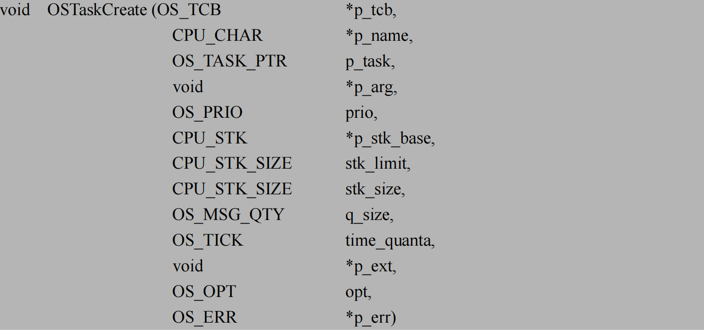
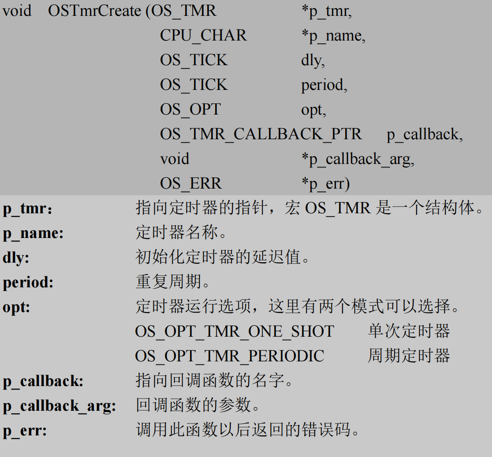
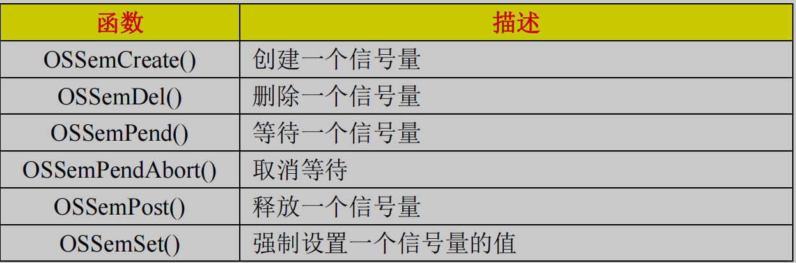
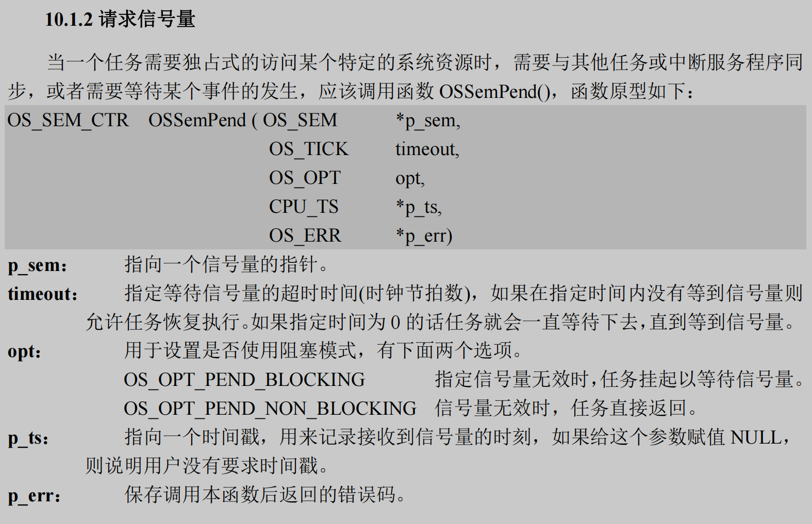
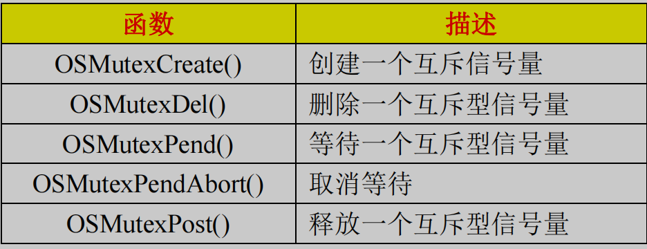
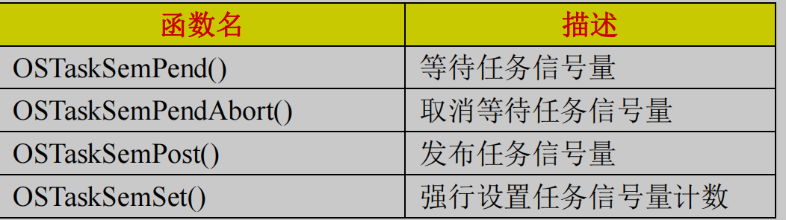
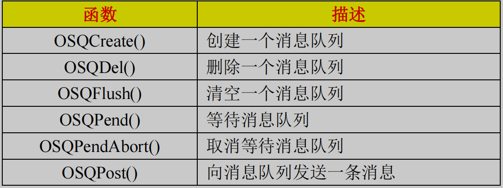
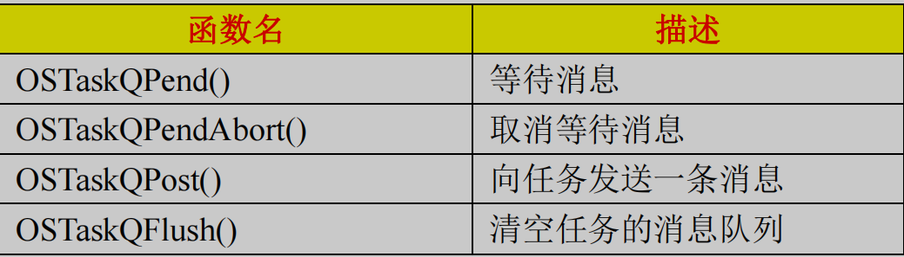
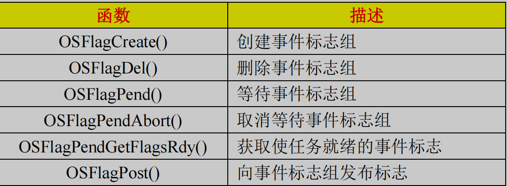

# UCOS III

OSInit()初始化 UCOSIII, 开始任务创建后 OSStart()开启 UCOSIII

## Contex-M3 基础

_不用操作系统的话一直都 handler 模式 , 只有一个 MSP 指针 , SVC 的中断响应 ; 指针的地址 1 位代表一个字节 , 线程中中断的响应是模式切换;_

### 寄存器

**通用寄存器; 连接寄存器; 两种堆栈寄存器; PC; 特殊功能寄存器**
都是 32 位字长的寄存器, MSP 为特权 , PSP 用于进程, LR 连接寄存器存放的调用子程序是储存返回的地址, 3 个中断屏蔽寄存器 PRIMASK, FAULTMASK, BASEPRI 用开设置屏蔽中断的优先级和中断开关 , 控制寄存器 用来定义特权级和堆栈指针 , EXC_RETURN 用来存放进入异常后应该返回的模式, 所以进入异常后 LR 的值被自动更新为 EXC_RETURN 的值

### 操作模式和特权级别

**特权级; 用户级; handler 模式; 线程模式**
用户级只能在线程模式下 只有触发中断才能进入特权级 , 中断完又回到用户级; 特权级 可以执行所以指令 ; 操作模式是为了区分普通代码和异常服务的代码 线程模式都可以使用 ; handler 模式只有特权级 ;

### 堆栈

**MSP; PSP**
使用哪一个通过控制寄存器来决定 ; 可以共同使用一个 MSP 也可以分开使用 ; handler 模式永远使用 MSP, 线程模式在异常时使用 MSP ; 入栈时有些寄存器自动入栈, 有些需要手动入栈 ; 最好双字对齐 , 即能被 8 整除

### SVC 和 PendSV

SVC: 为了将底层封装, 用户层产生系统函数的调用请求来访问硬件, 无需在特权模式进行 ; 通过指令代号来调用不同的函数, 立即得到响应应
PendSV : 可以缓期执行一个异常 ; 与 SVC 协同使用 ; 一般通过悬起一个 PendSV 异常来缓期执行上下文切换 ;

## 任务管理

### 初始化和启动 ucos

**初始化; 创建一个主任务; 启动 ucos**

### 任务状态

**休眠; 就绪; 运行; 等待; 中断服务**
休眠:是没有就绪的任务
就绪:创建后等待运行的任务
等待:正在运行的任务需要等待某一事件,比如信号,消息等,放弃 cup 使用权进入等待状态
中断服务:正在运行的任务被中断打断

### 任务控制块

**OS_TCB**
用来保存任务信息,创建任务的时候设置

### 任务堆栈

CPU_INT32U 类型的数组; 全局变量进行定义; 创建任务的时候传入数组; 用于任务切换时的数据保存;

### 任务就绪表

**OSPrioTbl[]; OSRdyList[]**
OSPrioTbl[]是 OSPrioTbl[0]的 bit31 优先级最高 0, bit31 优先级最低 31, OSPrioTbl[1]的 bit31 优先级是 32 依次递减 这样设置为了支持计算前导 0 指令; 当有任务就绪时就会将对应的优先级设置为 1;
OSRdyList[]是来管理一个优先权下的多个任务的, OSRdyList[0] 管理优先级 0 的任务通过双向链表指向 OS_TCB 来管理任务; 有些优先级只有一个任务

### 任务调度和切换

**两种任务调度; 时间片轮转调度**
任务调度有两种调度器任务级和中断级; 调用时如果调度器加锁则无法调度成功; 任务级不能在中断函数中使用,所以函数会关闭中断执行完成再打开, 执行时会保存当前任务的现场, 并查询 OSPrioTbl 执行优先级最高的就绪任务; 中断级, 是在中断服务函数退出时调用的,先记录中断嵌套计数器++, 再--, 只有为 0 时才进行任务切换; OS_CRITICAL_ENTER()禁止任务调度, OS_CRITICAL_EXIT()恢复任务调度; OSSched()进行任务调度; OSSchedLock()任务调度上锁 OSSchedUnlock()恢复;
时间片轮转调度: 一个任务运行一段时间后让出 cpu 使用权, 让拥有同一个优先级的下一个任务运行; OS_TCB 的 TimeQuantaCtr 记录这轮转的时间,当为 0 时检测 NbrEntries 的值, 大于 2 则切换下一个任务,获取新的 OSRdyList['0']的表头和链表, 将刚刚运行的任务放入表尾,运行表头的任务, TimeQuantaCtr 没有指定值的话有默认值

## API 函数使用

### 创建和删除任务

; CPU_STK_SIZE 第一个为栈溢出标志得的剩余量

### 任务挂起和恢复

void OSTaskSuspend (OS*TCB \*p_tcb,OS* ERR *p_err)
void OSTaskResume(OS_TCB *p*tcb,OS* ERR \*p_err)
可以调用多个挂起, 但要调用同样次数的恢复函数才能恢复

### 时间片轮转

使用时间片轮转调度就需要将 OS_CFG_SCHED_ROUND_ROBIN_EN 定义为 1; 并且调用初始化函数来使能和设置一个时间片的长度; 轮转的个数和几个时间片在任务初始化设置第一个参数是使能, 第二个单个时间片的长度
void OSSchedRoundRobin_Yield (OS_ERR\*p_err) 让出本次轮转的 cpu 使用权到同优先级的另外一个任务

## 内部任务

**空闲任务; 时钟节拍任务; 统计任务; 定时任务; 中断服务管理任务; 钩子函数**
**空闲任务:** OS*IdleTask()系统初始化时创建的空闲任务; 优先级为 63, 系统规定的最大任务数为 64; 每进入一次该函数 OSIdleTaskCtr++, 可以通过 OSIdleTaskCtr 的大小判断 cpu 的繁忙率
**时钟节拍任务:** OS_Ticktask()是系统自动创建的; 优先级为 1; 时钟节拍任务的作用是跟踪正在延时的任务,以及在指定时间内等待某个内核对象的任务; 会在滴答定时器的中断服务函数中调用; 请求信号量和时钟节拍列表
**统计任务:** OS_CFG_STAT_TASK_EN 置为 1; 在起始任务中调用 OSStatTaskCPUUsageInit(&err)打开任务函数, 优先级为 62; 通过全局变量的值 OSStatTaskCPUUsage 来判断 cpu 的使用率; OS_CFG_STAT_TASK_STK_CHK_EN 置为 1 可以检测每个任务堆栈的使用情况, 写入每个任务 OS_TCB 的 StkFree 和 StkUsed 中;
**定时任务:** : OS_CFG_TMR_EN 置为 1; 优先级默认为 2; 提供软件定时功能, 定时任务可选; OS_TmrInit()初始化; 可以通过 oS_CFG_TMR_TASK* PRIO 来设置定时任务的优先级
**中断服务管理任务:**OS_CFG_ISR_POST_DEFERRED_EN 置为 1 OS_IntQTast(); 优先级最高 0; 管理临界段代码可以关中断和调度器上锁两种办法, 调度器上锁中断服务管理函数调用的"post"类函数无法访问就续表等数据结构; 为了管理嵌套的 ISR 中所发送的数据和发送的目的地, 当嵌套中断执行完毕后调用"post"将数据和等信号依次发送, 省去 ISR 将任务放入就绪表等耗时操作
**钩子函数:**系统消息触发时的处理函数, 一共有 8 个, 比如空闲任务的钩子函数: OS_CFG_APP_HOOKS_EN 置为 1, 当空闲任务触发就会执行 void App_OS_IdleTaskHook (void)函数, 由用户自己编写, 不能让其进入等待的状态

## 中断和时间管理

**中断处理过程; 直接发布和延迟发布; System 时钟和临界段代码保护; 时间管理函数**
**中断处理过程:** ucosiii 是嵌套中断处理模式, 中断开始前先调用中断任务调度器 OSIntEnter()函数, 再编写中断代码, 最后再调用中断任务切换函数 OSIntExit()退出当前中断
**直接发布和延迟发布:** OS_CFG_ISR_POST_DEFERRED_EN 为 1 是延迟发布; 直接发布: 通过关中断的方法保护临界段代码, 时间长, 当有信号, 消息等直接发布, 可能使一些任务进入就绪状, 中断代码结束后进行一次任务调度; 延迟发布: 通过禁止任务调度来保护临界段代码, 时间短, 当有信号,消息等时时将其写入到中断队列中, 当退出中断程序时将中断服务管理任务挂起, 中断服务管理函数先关中断来提取发布函数调用信息再开中断, 禁止任务调度来执行发布函数, 中断服务管理函数结束后进行任务调度; 延迟发布关中断的时间非常短;
**System 时钟和临界段代码保护:** Systick 中断服务程序会调用对应的钩子函数, 处理中断队列的发布函数的调用请求, 给时钟节拍任务发送信号量, 向定时器任务发送信号量;
**时间管理函数:** OSTimeDly(dly, opt, ...) 对任务进行延迟, dly 为延迟的的节拍数, opt 第一个相对模式延迟一次, 第 3 个绝对模式上电后多少时间执行该任务, 第 4 个周期模式, 周期执行该任务; OSTimeDlyHMSM(hours, minutes, ...) 延迟的具体时间 opt 多了可以检查时间参数的选项; OSTimeDlyResume(p_tcb, err) 恢复延迟的任务;

## 软件定时器

**1.定时器分类; 2.如何创建;**

1. 单次定时器 dly: 节拍数, opt: OS*OPT_TMR_ONE_SHOT, 可以 OSTmrStart()再次开启; 周期定时器 dly 为 0 的按照 period 循环, 否则初始化延迟是 dly opt: OS* OPT TMR PERIODIC
2. ; OSTmrStop 来删除定时器

## 信号量

任务请求信号量时, 如果信号量的 Ctr 为大于 0, 则请求成功, Ctr--, 请求完释放, Ctr++; 更多的用于任务间的同步和ISR和任务间的同步;

**1.计数信号量; 2.互斥信号量; 3.内嵌信号量**

1. ; 创建信号量的 CTR 值代表可以有多少任务同时访问该信号, SEM 为指向信号量的控制块, 还可以设置请求的时间; ; 发送信号量可以选择向等待的优先级最高的发送还是发送给所有等待的任务
2. 中断不可以使用; 
3. 每个任务创建时都有; ; 发布任务信号量的任务当指向 NULL 是发送信号量给自己, 可以选择是否在该函数进行任务调度, OS_OPT_POST_NO_SCHED 禁止任务调度

## 消息传递

任务之间交流

**1.消息队列; 2.内嵌消息队列**

1. ; 创建消息队列要指定长度; 等待消息队列需要设置是等待阻塞还是没有消息的话任务直接返回以及超时时间和等待的消息的长度; 向消息队列发送消息, 需要数据首地址, 大小, 以及选择 fifo 或 lifo, 接收消息 all 还是一个; ISR 只能发送消息
2. ; OS_CFG_TASK_QEN 需要置 1;

## 事件标志组

多个任务之间的同步

**1.事件标志组介绍; 2.相关函数**

1. 任务等待事件的发生, 比如等待 bit0 和 1 时就是 flags 就是 3, 可以选择 bit1 和 0 的等待成功条件;
2. 

## 任务的多等待

任务等待多个消息和信号量

OSPendMulti()函数; 通过头指针指向将信号量和消息等通过链表链接起来; 等待到一个便成功执行;

## 内存管理

因为 malloc 申请的内存过于分散, 不适合嵌入式单片机

**1.存储区创建; 2.申请内存和释放**

1.  一般先定义一个全局变量的二维数组; OSMemCreate()创建存储区, 将数组行数表示为 block 数, 列数的字节数表示单个 block 大小, 二维数组名为首地址;
2.  OSMemGet()返回申请到的一个存储块内存的地址 只能申请一个储存块; OSMemPut()指定存储块地址释放;
