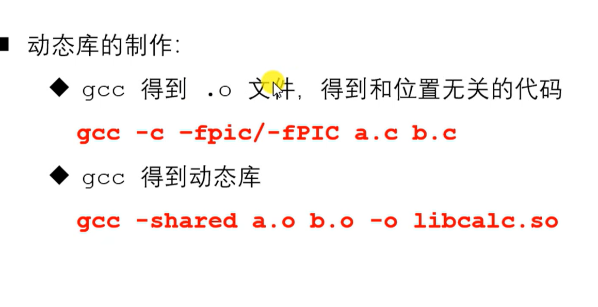
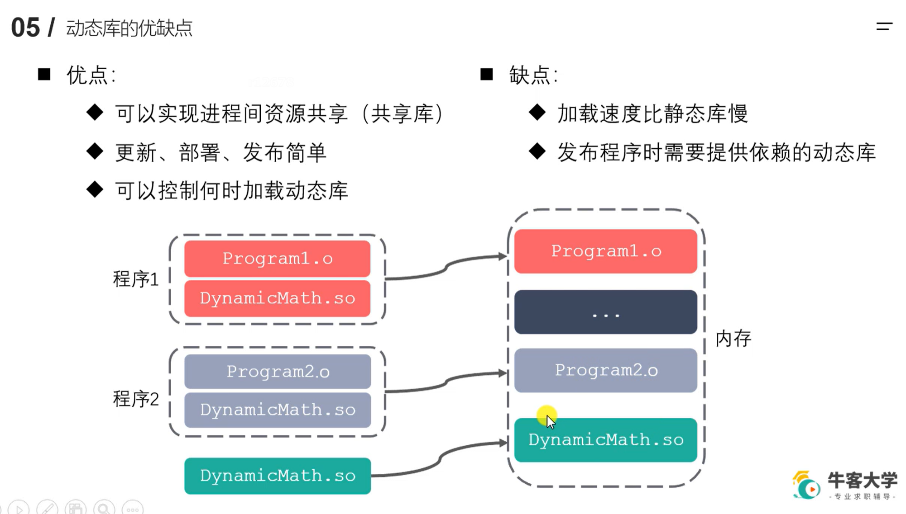
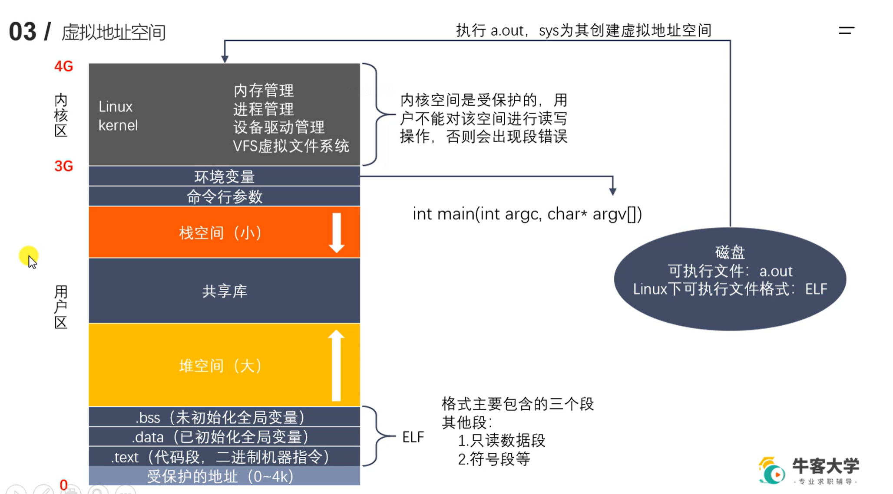

WebServer
我在实习前看的是大佬 (牛客id:健康成长天线宝宝啊 )的个人项目WebServer:https://github.com/linyacool/WebServer。基于他的项目和我后续看书的总结，在1-2个月的时间里我也实现了一个web服务器，这个项目是我简历上除了实习项目之外被问的最多的项目。
2.看STL源码：
STL源码，有各种C++高级技能的实现。推荐大家去看看STL里的快排实现源码，第一次看到真的很有意思。
3.开源项目：
下面是几个还不错的开源项目，如果当前有不错的基础可以去通过源码学习：
libevent：Libevent是一个轻量级的开源高性能网络库，采用事件触发，封装了以下三种事件的响应:IO事件,定时器事件,信号事件。
Memcached：Memcached 是一个高性能的分布式内存对象缓存系统，用于动态Web应用以减轻数据库负载。它通过在内存中缓存数据和对象来减少读取数据库的次数，从而提高动态数据库驱动网站的速度。
Redis：Redis是一个基于纯内存的存储系统，虽然是C写的但是值得一看。

### GCC
g++和gcc的区别, g++会定义一个c++编译的宏, g++编译阶段会调用gcc, gcc不能自动和c++的库相连接; -I '头文件目录'; -D '宏名'; -w 不生成警告; -O'n' 优化级别;
-l 指定使用的库; -L '链接库目录' ; -shared; -std 指定标准名称;
静态库:命名: Linux: libxxx.a, windows: libxxx.lib;;tree;
;;
ldd APP 列出APP所依赖的动态库;;
;  ;
; ;
;
### GDD
;;
;
### 文件系统
; ;
;;
相同文件打开,文件描述符不一样;
man 2 open ; man 3 fseek查看系统的open函数说明; ll; umask;
lseek()和c标准库的fseek();